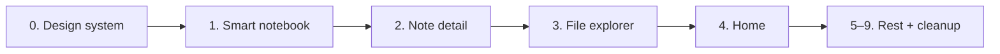

# Legacy-to-Compose Migration Plan

This plan migrates all functionalities from the legacy Android UI into the shared Compose-based app. **Note-taking (notebook + note detail) is migrated first** as the core of the application. All screens and components follow **design.json** (Inkwise Design System).

**Design reference:** `design.json` — Soft Editorial Productivity; earthy-neutral with green primary; colors, typography, spacing, radius, shadows, and component specs (buttons, cards, chips, inputs, top bar, list items). Use it for every new screen and shared component.

---

## Migration order (note-taking first)

| Phase | Focus                                         | Compose target                   | Legacy to remove                                            |
| ----- | --------------------------------------------- | -------------------------------- | ----------------------------------------------------------- |
| 0     | Design system from design.json                | ThemeRegistry, shared components | —                                                           |
| 1     | **Note-taking: Notebook**                     | SmartNotebookScreen              | SmartNotebookActivity, ViewModel, Adapter, state machine    |
| 2     | **Note-taking: Note (text/handwritten/init)** | NoteDetailScreen                 | TextNoteFragment, HandwrittenNoteFragment, InitNoteFragment |
| 3     | File explorer                                 | FileExplorerScreen               | DirectoryExplorerActivity, ViewModel                        |
| 4     | Home completeness                             | NotebookListScreen               | —                                                           |
| 5     | Related notes                                 | RelatedNotesScreen               | RelatedNotesActivity, ViewModel                             |
| 6     | Query creation                                | QueryCreationScreen              | QueryCreationActivity, QueryViewModel                       |
| 7     | Query results                                 | QueryResultsScreen               | QueryResultsActivity, QueryResultsViewModel                 |
| 8     | Note search                                   | SearchScreen                     | NoteSearchActivity, NoteSearchViewModel                     |
| 9     | Admin                                         | AdminScreen                      | AdminActivity, AdminViewModel                               |
| 10    | Cleanup                                       | —                                | Routing, manifest, appModule, Room, resources               |

---

## Current state (prerequisites)

- **Launcher:** App launches with `ComposeHostActivity`; home is `NotebookListScreen` (Compose).
- **Stubs / TBD:** SmartNotebookScreen, NoteDetailScreen, SearchScreen, QueryResultsScreen, AdminScreen, FileExplorerScreen, RelatedNotesScreen, and QueryCreationScreen are stubs or placeholders.
- **Legacy still present:** Legacy Activities, Fragments, and ViewModels remain and are reachable via `Routing.kt`. This plan migrates each flow into Compose, then removes the corresponding legacy code.

---

## Key file paths

- **Shared UI and theme:** [shared/src/commonMain/kotlin/org/basnalcorp/shared/ui/](shared/src/commonMain/kotlin/org/basnalcorp/shared/ui/) (screens, nav, theme, LayoutContext).
- **Design reference:** [design.json](design.json) (project root).
- **Legacy Android:** [androidApp/src/main/java/com/originb/inkwisenote2/](androidApp/src/main/java/com/originb/inkwisenote2/) (modules: smarthome, smartnotes, notesearch, queries, fileexplorer, admin, noterelation; `Routing.kt`, `AppModules.kt`).
- **Compose host:** [androidApp/.../ComposeHostActivity.kt](androidApp/src/main/java/com/originb/inkwisenote2/ComposeHostActivity.kt); [desktopApp/.../Main.kt](desktopApp/src/main/kotlin/com/originb/inkwisenote2/desktop/Main.kt).

---

## Phase 0: Design system (design.json)

**Goal:** Apply `design.json` to the shared UI so every migrated screen uses the same tokens (colors, typography, spacing, radius, shadows, components).

### 0.1 Design tokens in shared

| Task ID | Task                               | Details                                                                                                                                                                                                                                                                                                                                                   |
| ------- | ---------------------------------- | --------------------------------------------------------------------------------------------------------------------------------------------------------------------------------------------------------------------------------------------------------------------------------------------------------------------------------------------------------- |
| 0.1.1   | Add design token types/constants   | In shared (e.g. `ui/theme/DesignTokens.kt` or read from resource): map design.json to Kotlin constants. **Colors:** primary base/hover/light, accent warm/soft_orange, background primary/secondary, dark_mode_base, surface card_light/card_tinted/card_dark, text primary/secondary/inverse/muted, border light/subtle, feedback success/warning/error. |
| 0.1.2   | **ThemeRegistry from design.json** | Replace default `lightColorScheme()`/`darkColorScheme()` with schemes built from design.json: Light theme uses background.primary `#F5EFE6`, primary.base `#2E7D4F`, surface.card_light `#FFFFFF`, text.primary `#1E1E1E`, etc.; Dark theme uses background.dark_mode_base `#0F2B2C`, surface.card_dark `#1E3A3B`, text.inverse.                          |
| 0.1.3   | **Typography from design.json**    | Add Compose `Typography` (or extend MaterialTheme) from design.json: display 28sp/700, heading_l 22sp/600, heading_m 18sp/600, body_l 16sp/400, body_m 14sp/400, caption 12sp/400; letter-spacing heading -0.3px. Apply in ThemeRegistry or MaterialTheme.                                                                                                |
| 0.1.4   | **Spacing and radius constants**   | Define from design.json: spacing scale (4,8,12,16,20,24,32,40,48,64), layout_padding_mobile 20, card_padding 16, section_spacing 24; radius button 24, card 20, input 16, pill 999, modal 28. Use in composables as Dp.                                                                                                                                   |
| 0.1.5   | **Shadow from design.json**        | Soft shadow (offset_y 4, blur 16, rgba 0.05); medium (8, 24, 0.08). Expose as Modifier or Shape for cards; respect “none on dark” if applicable.                                                                                                                                                                                                          |

### 0.2 Reusable components (design.json)

| Task ID | Task                 | Details                                                                                                                                                                                    |
| ------- | -------------------- | ------------------------------------------------------------------------------------------------------------------------------------------------------------------------------------------ |
| 0.2.1   | **Primary button**   | Composable per design.json: height 52.dp, radius 24.dp, fill primary.base, text color text.inverse, font weight 600.                                                                       |
| 0.2.2   | **Secondary button** | Height 48.dp, radius 24.dp, fill surface.card_tinted, text primary.base.                                                                                                                   |
| 0.2.3   | **Ghost button**     | Height 44.dp, transparent, text primary.base; touch target min 44.dp (accessibility).                                                                                                      |
| 0.2.4   | **Card**             | Soft elevated style: radius 20.dp, padding 16.dp, background surface.card_light, soft shadow; content structure: optional header, title, supporting text, optional media, optional action. |
| 0.2.5   | **Chip**             | Height 36.dp, radius 999 (pill); selected: primary.base bg, text.inverse; unselected: card_tinted bg, text.primary; padding horizontal 16.dp.                                              |
| 0.2.6   | **Text input**       | Height 52.dp, radius 16.dp, background #F7F7F7, border 1px border.light, focus border primary.base.                                                                                        |
| 0.2.7   | **Top app bar**      | Height 56.dp, transparent bg, title left-aligned, icon size 24.dp (design.json top_bar).                                                                                                   |
| 0.2.8   | **List item**        | Height 56.dp, optional subtle divider, left text + optional right icon; touch target ≥ 44.dp.                                                                                              |

### 0.3 Apply to existing screens

| Task ID | Task                             | Details                                                                                                                                      |
| ------- | -------------------------------- | -------------------------------------------------------------------------------------------------------------------------------------------- |
| 0.3.1   | **NotebookListScreen**           | Use design tokens: card radius 20, padding 16, soft shadow; top bar 56.dp; primary/ghost for actions; spacing section 24, layout padding 20. |
| 0.3.2   | **QueryListScreen**              | Same: cards, top bar, spacing from design.json.                                                                                              |
| 0.3.3   | **RootNavGraph / MaterialTheme** | Ensure ThemeRegistry.get() supplies ColorScheme + Typography from design.json so all screens inherit.                                        |

**Exit criteria:** Theme and shared components (buttons, cards, chips, inputs, top bar, list item) follow design.json; NotebookListScreen and QueryListScreen use them.

---

## Phase 1: Smart notebook (note-taking core – notebook with pages)

**Goal:** Replace SmartNotebookActivity with SmartNotebookScreen: one notebook (book + ordered pages), grid of note cards, navigation to note detail. All UI from design.json.

### 1.1 Inspection and state design

| Task ID | Task                                                     | Details                                                                                                                                                                                                                                                                            |
| ------- | -------------------------------------------------------- | ---------------------------------------------------------------------------------------------------------------------------------------------------------------------------------------------------------------------------------------------------------------------------------- |
| 1.1.1   | Inspect SmartNotebookActivity and SmartNotebookViewModel | Document: inputs (bookId, workingPath, bookTitle, noteIds, selectedNoteId), load notebook (book + pages + atomic notes), current page index, prev/next, select note, “Related notes”, “new note”/add page, delete; dependencies (SmartNotebookRepository, updateNotebook, delete). |
| 1.1.2   | Define SmartNotebookStateHolder API                      | In shared: load(bookId, workingPath?, …), Flow, currentPageIndex, setCurrentPage(i), selectNote(noteId), addPage(), deleteNotebook(); handle Route.SmartNotebook(bookId=null, workingPath) for new notebook.                                                                       |
| 1.1.3   | Implement SmartNotebookStateHolder                       | Implement in shared using SmartNotebookRepository and existing repos; register in sharedModule(). Decide: single holder updated when route changes vs keyed by route (e.g. bookId+workingPath).                                                                                    |
| 1.1.4   | Wire state into RootNavGraph                             | Pass SmartNotebookStateHolder (or factory) and route args into SmartNotebookScreen.                                                                                                                                                                                                |

### 1.2 SmartNotebookScreen UI (design.json)

| Task ID | Task                           | Details                                                                                                                                                                                                                                                        |
| ------- | ------------------------------ | -------------------------------------------------------------------------------------------------------------------------------------------------------------------------------------------------------------------------------------------------------------- |
| 1.2.1   | **Top bar**                    | design.json top_bar (56.dp, transparent, left title): notebook title; back (onBack); optional “Related notes” → onNavigate(Route.RelatedNotes(bookId)); use Typography heading_m for title.                                                                    |
| 1.2.2   | **Note cards grid**            | Card per design.json: radius 20, padding 16, soft shadow, structure title/supporting text/optional media. LazyVerticalGrid; tap → onNavigate(Route.NoteDetail(bookId, noteId, isHandwritten)). Compact: 1–2 columns; Expanded: multi-column (e.g. min 200.dp). |
| 1.2.3   | **Page indicator / prev-next** | If multiple “pages” of cards: use design spacing (section 24, padding 20); buttons secondary or ghost; touch target ≥ 44.dp.                                                                                                                                   |
| 1.2.4   | **Empty state**                | “No notes yet” with secondary button “Add note” (primary button 52.dp, radius 24) opening init-note flow or Route.                                                                                                                                             |
| 1.2.5   | **LayoutContext**              | Compact vs Medium vs Expanded per screen contract; use spacing_system layout_padding_mobile 20, section_spacing 24.                                                                                                                                            |
| 1.2.6   | **New notebook (virtual)**     | Support Route.SmartNotebook(bookId=null, workingPath). State holder creates notebook on first save; screen shows empty grid + “Add note”.                                                                                                                      |

### 1.3 Removal

| Task ID | Task                                                  | Details                                                                                                                                                                                    |
| ------- | ----------------------------------------------------- | ------------------------------------------------------------------------------------------------------------------------------------------------------------------------------------------ |
| 1.3.1   | Remove SmartNotebookActivity                          | Delete SmartNotebookActivity.kt, remove from AndroidManifest and Routing.                                                                                                                  |
| 1.3.2   | Remove SmartNotebookViewModel, adapter, state machine | Delete SmartNotebookViewModel, SmartNotebookAdapter, FragmentViewHolder (notebook grid part), ISmartNotebookActivityState and implementations. Do not remove note fragments yet (Phase 2). |

**Exit criteria:** Opening a notebook from home shows SmartNotebookScreen with grid of note cards; tapping a card navigates to NoteDetailScreen (stub OK until Phase 2). Legacy SmartNotebookActivity and related classes removed.

---

## Phase 2: Note detail (text, handwritten, init note)

**Goal:** Replace TextNoteFragment, HandwrittenNoteFragment, and InitNoteFragment with NoteDetailScreen (text editor, drawing, “create new note” flow). All UI from design.json.

### 2.1 Inspection and state design

| Task ID | Task                                                                | Details                                                                                                                                                          |
| ------- | ------------------------------------------------------------------- | ---------------------------------------------------------------------------------------------------------------------------------------------------------------- |
| 2.1.1   | Inspect TextNoteFragment, HandwrittenNoteFragment, InitNoteFragment | List: text edit/save, drawing/strokes/recognition, init (choose type, create). Dependencies: DrawingView expect/actual, OCR/digital ink, text/handwritten repos. |
| 2.1.2   | Define NoteDetailStateHolder API                                    | Load(bookId, noteId, isHandwritten), text content or strokes; saveText(text), saveStrokes(...); createNewNote(bookId, type: Text                                 |
| 2.1.3   | Implement NoteDetailStateHolder                                     | In shared; use shared repositories; for strokes use platform APIs via expect/actual. Register in sharedModule() or create per-route.                             |
| 2.1.4   | Wire state into RootNavGraph / NoteDetailScreen                     | Pass holder (or args) when route is Route.NoteDetail(bookId, noteId, isHandwritten).                                                                             |

### 2.2 NoteDetailScreen UI (design.json)

| Task ID | Task                        | Details                                                                                                                                                                                           |
| ------- | --------------------------- | ------------------------------------------------------------------------------------------------------------------------------------------------------------------------------------------------- |
| 2.2.1   | **Top bar**                 | design.json top_bar: title (note name or “New note”), back; optional “Save” as primary button (52.dp, 24 radius).                                                                                 |
| 2.2.2   | **Text note**               | Full-width text field per design.json input (52.dp height for single line or multiline with body_l 16sp, line height 1.5); card or surface for content area; spacing 20 padding.                  |
| 2.2.3   | **Handwritten note**        | Drawing area with expect/actual DrawingView; toolbar above or below (e.g. clear, undo) using ghost/secondary buttons; touch target ≥ 44.dp.                                                       |
| 2.2.4   | **Init note (choose type)** | When noteId is “new” or from “Add note”: two cards (design.json card 20 radius, 16 padding) “Text note” / “Handwritten note”; tap navigates to same screen with type and new noteId after create. |
| 2.2.5   | **LayoutContext**           | Compact single column; Expanded optional two-pane (e.g. list + detail) if needed later.                                                                                                           |
| 2.2.6   | **Feedback**                | Use PlatformActions.showToast for “Saved” / errors; design.json feedback colors (success/error).                                                                                                  |

### 2.3 Removal

| Task ID | Task                      | Details                                                                                |
| ------- | ------------------------- | -------------------------------------------------------------------------------------- |
| 2.3.1   | Remove note fragments     | Delete TextNoteFragment, HandwrittenNoteFragment, InitNoteFragment, NoteFragment base. |
| 2.3.2   | Remove fragment factories | Remove Fragment factories for note types from appModule.                               |

**Exit criteria:** Text and handwritten notes are viewable/editable in Compose; “Add note” from notebook works. All note fragments removed.

---

## Phase 3: File explorer

**Goal:** Replace DirectoryExplorerActivity with FileExplorerScreen; design.json for list, cards, and actions.

### 3.1 Inspection and state

| Task ID | Task                                                             | Details                                                                                                                                       |
| ------- | ---------------------------------------------------------------- | --------------------------------------------------------------------------------------------------------------------------------------------- |
| 3.1.1   | Inspect DirectoryExplorerActivity and DirectoryExplorerViewModel | List: directory listing, grouping, file/folder click, delete group, swipe refresh; dependencies (file system, showFilePicker, BackgroundOps). |
| 3.1.2   | Expect/actual for directory listing                              | If missing: expect listDirectory(path), getAppStorageRoot(); implement in androidMain/jvmMain.                                                |
| 3.1.3   | Add FileExplorerStateHolder                                      | Current path, list of file groups/items, loading/error; Flow or state; register in sharedModule().                                            |
| 3.1.4   | Wire state into FileExplorerScreen                               | RootNavGraph passes holder and Route.FileExplorer(initialPath).                                                                               |

### 3.2 FileExplorerScreen UI (design.json)

| Task ID | Task                   | Details                                                                                                                                                                                                                                           |
| ------- | ---------------------- | ------------------------------------------------------------------------------------------------------------------------------------------------------------------------------------------------------------------------------------------------- |
| 3.2.1   | **Top bar**            | design.json top_bar: title “File explorer”, back.                                                                                                                                                                                                 |
| 3.2.2   | **Current path**       | Body_m text, muted color; padding 20.                                                                                                                                                                                                             |
| 3.2.3   | **List/grid of items** | List item 56.dp height, optional divider (border.subtle); folder vs file icon; tap folder → update path; tap file/folder → “Create notebook here” → Route.SmartNotebook(workingPath = path). Use cards (radius 20) for group headers if grouping. |
| 3.2.4   | **Pull-to-refresh**    | Use design spacing; loading state with muted caption.                                                                                                                                                                                             |
| 3.2.5   | **Empty state**        | Caption text “No files”; secondary button “Open folder” if showFilePicker used.                                                                                                                                                                   |

### 3.3 Removal

| Task ID | Task                             | Details                                                                         |
| ------- | -------------------------------- | ------------------------------------------------------------------------------- |
| 3.3.1   | Remove DirectoryExplorerActivity | Delete activity, ViewModel, adapter, layouts; remove from manifest and Routing. |

**Exit criteria:** File explorer works from Compose; legacy Activity/ViewModel removed.

---

## Phase 4: Home completeness

**Goal:** NotebookListScreen has all entry points (Search, Queries, Admin, File explorer, FAB “New note”) and uses design.json throughout.

### 4.1 Tasks

| Task ID | Task                                        | Details                                                                                                                                                                                     |
| ------- | ------------------------------------------- | ------------------------------------------------------------------------------------------------------------------------------------------------------------------------------------------- |
| 4.1.1   | **File explorer entry**                     | In Compact and Expanded layouts add action (icon or list item) → onNavigate(Route.FileExplorer(null)); design top_bar icon 24.dp.                                                           |
| 4.1.2   | **FAB “New note”**                          | Floating action button (design: primary color or accent) → onNavigate(Route.FileExplorer(initialPath)) or Route.SmartNotebook(workingPath = appStorageRoot()); ensure touch target ≥ 44.dp. |
| 4.1.3   | **Apply design.json to NotebookListScreen** | Cards (20 radius, 16 padding, soft shadow), spacing 24 section/20 padding, typography heading_m for titles, body_l for supporting text.                                                     |
| 4.1.4   | **Verify no legacy launch**                 | No Compose path starts SmartHomeActivity or Routing.openSmartHomePageAndStartFresh.                                                                                                         |

**Exit criteria:** Home has Search, Query list, Admin, File explorer, and FAB; design.json applied; no legacy dependency.

---

## Phase 5: Related notes

**Goal:** RelatedNotesScreen with list of related notes; design.json cards and list items.

### 5.1 State and wiring

| Task ID | Task                                   | Details                                                                                                         |
| ------- | -------------------------------------- | --------------------------------------------------------------------------------------------------------------- |
| 5.1.1   | Add RelatedNotesStateHolder(bookId, …) | Load related notes; Flow<List<...>>; register in sharedModule(); pass when route is Route.RelatedNotes(bookId). |
| 5.1.2   | Implement RelatedNotesStateHolder      | Use NoteRelationRepository / SmartNotebookRepository (or shared equivalents).                                   |

### 5.2 RelatedNotesScreen UI (design.json)

| Task ID | Task              | Details                                                                                                                                                                              |
| ------- | ----------------- | ------------------------------------------------------------------------------------------------------------------------------------------------------------------------------------ |
| 5.2.1   | **Top bar**       | “Related notes”, back.                                                                                                                                                               |
| 5.2.2   | **List of cards** | design.json card (20 radius, 16 padding, soft shadow); tap → Route.NoteDetail(bookId, noteId, isHandwritten) or Route.SmartNotebook. List item 56.dp min height; section spacing 24. |
| 5.2.3   | **Empty state**   | Caption “No related notes”.                                                                                                                                                          |

### 5.3 Removal

| Task ID | Task                                                  | Details                                                                                                |
| ------- | ----------------------------------------------------- | ------------------------------------------------------------------------------------------------------ |
| 5.3.1   | Remove RelatedNotesActivity and RelatedNotesViewModel | Delete; remove from manifest and Routing; update call sites to onNavigate(Route.RelatedNotes(bookId)). |

**Exit criteria:** Related notes screen works from Compose; legacy removed.

---

## Phase 6: Query creation

**Goal:** QueryCreationScreen with name, words-to-find / words-to-ignore chips, save; design.json inputs and chips.

### 6.1 State and wiring

| Task ID | Task                     | Details                                                                                                                      |
| ------- | ------------------------ | ---------------------------------------------------------------------------------------------------------------------------- |
| 6.1.1   | Query creation state     | Local Compose state (name, find words list, ignore words list) or QueryCreationStateHolder; save via shared QueryRepository. |
| 6.1.2   | Wire save and navigation | On save → insert query → onNavigate(Route.QueryList) or onBack().                                                            |

### 6.2 QueryCreationScreen UI (design.json)

| Task ID | Task                | Details                                                                                                                                         |
| ------- | ------------------- | ----------------------------------------------------------------------------------------------------------------------------------------------- |
| 6.2.1   | **Top bar**         | “New query”, back.                                                                                                                              |
| 6.2.2   | **Query name**      | design.json input (52.dp, radius 16, #F7F7F7, border); body_l label.                                                                            |
| 6.2.3   | **Words to find**   | Chip group: design.json chips (36.dp, pill, selected primary/base, unselected card_tinted); add from text input (same input spec); remove chip. |
| 6.2.4   | **Words to ignore** | Same chip treatment.                                                                                                                            |
| 6.2.5   | **Save button**     | Primary button 52.dp, radius 24. Section spacing 24 between sections.                                                                           |

### 6.3 Removal

| Task ID | Task                                            | Details                                   |
| ------- | ----------------------------------------------- | ----------------------------------------- |
| 6.3.1   | Remove QueryCreationActivity and QueryViewModel | Delete; remove from manifest and Routing. |

**Exit criteria:** Create/save query in Compose; legacy removed.

---

## Phase 7: Query results

**Goal:** QueryResultsScreen with list of matching notebooks; design.json cards.

### 7.1 State and wiring

| Task ID | Task                                      | Details                                                                                                    |
| ------- | ----------------------------------------- | ---------------------------------------------------------------------------------------------------------- |
| 7.1.1   | Add QueryResultsStateHolder(queryName, …) | Load query, run search (NoteTfIdfLogic), Flow; register; pass when route is Route.QueryResults(queryName). |
| 7.1.2   | Implement QueryResultsStateHolder         | Use QueryRepository, NoteTfIdfLogic, SmartNotebookRepository.                                              |

### 7.2 QueryResultsScreen UI (design.json)

| Task ID | Task              | Details                                                                                                                     |
| ------- | ----------------- | --------------------------------------------------------------------------------------------------------------------------- |
| 7.2.1   | **Top bar**       | “Results: [queryName]”, back.                                                                                               |
| 7.2.2   | **Notebook list** | Same card style as NotebookListScreen (20 radius, 16 padding); tap → Route.SmartNotebook(bookId). Compact/Expanded layouts. |
| 7.2.3   | **Empty state**   | “No matches”.                                                                                                               |

### 7.3 Removal

| Task ID | Task                                                  | Details                                   |
| ------- | ----------------------------------------------------- | ----------------------------------------- |
| 7.3.1   | Remove QueryResultsActivity and QueryResultsViewModel | Delete; remove from manifest and Routing. |

**Exit criteria:** Query results screen works from Compose; legacy removed.

---

## Phase 8: Note search

**Goal:** SearchScreen with search input and results grid; design.json input and cards.

### 8.1 State and wiring

| Task ID | Task                        | Details                                                                  |
| ------- | --------------------------- | ------------------------------------------------------------------------ |
| 8.1.1   | Add SearchStateHolder       | search(query), loadAllNotebooks(); Flow; register; pass to SearchScreen. |
| 8.1.2   | Implement SearchStateHolder | Use SmartNotebookRepository, optional NoteTfIdfLogic.                    |

### 8.2 SearchScreen UI (design.json)

| Task ID | Task             | Details                                                                                                               |
| ------- | ---------------- | --------------------------------------------------------------------------------------------------------------------- |
| 8.2.1   | **Top bar**      | “Search”, back.                                                                                                       |
| 8.2.2   | **Search field** | design.json input (52.dp, radius 16); search button primary or ghost.                                                 |
| 8.2.3   | **Results**      | Grid/list of notebook cards (same as home); tap → Route.SmartNotebook(bookId). Optional “All notebooks” chip or link. |
| 8.2.4   | **Empty state**  | “No results” / “Enter a search”.                                                                                      |

### 8.3 Removal

| Task ID | Task                                              | Details                                   |
| ------- | ------------------------------------------------- | ----------------------------------------- |
| 8.3.1   | Remove NoteSearchActivity and NoteSearchViewModel | Delete; remove from manifest and Routing. |

**Exit criteria:** Search screen works from Compose; legacy removed.

---

## Phase 9: Admin

**Goal:** AdminScreen with same actions/info as AdminActivity; design.json for layout and buttons.

### 9.1 State and wiring

| Task ID | Task                                     | Details                                                                       |
| ------- | ---------------------------------------- | ----------------------------------------------------------------------------- |
| 9.1.1   | Inspect AdminActivity and AdminViewModel | List UI elements and data sources.                                            |
| 9.1.2   | Add AdminStateHolder if needed           | Counts or one-shot calls from shared repos; register and pass to AdminScreen. |

### 9.2 AdminScreen UI (design.json)

| Task ID | Task         | Details                                                                                                                                      |
| ------- | ------------ | -------------------------------------------------------------------------------------------------------------------------------------------- |
| 9.2.1   | **Top bar**  | “Admin”, back.                                                                                                                               |
| 9.2.2   | **Sections** | Card or list items (56.dp, optional divider); DB stats, export, clear cache, debug toggles; use secondary/ghost buttons; section spacing 24. |
| 9.2.3   | **Toasts**   | PlatformActions.showToast for feedback.                                                                                                      |

### 9.3 Removal

| Task ID | Task                                    | Details                                   |
| ------- | --------------------------------------- | ----------------------------------------- |
| 9.3.1   | Remove AdminActivity and AdminViewModel | Delete; remove from manifest and Routing. |

**Exit criteria:** Admin screen works from Compose; legacy removed.

---

## Phase 10: Final cleanup

**Goal:** No legacy Activities/Fragments; single Compose entry; appModule and manifest cleaned; design.json applied app-wide.

### 10.1 Tasks

| Task ID | Task                                                | Details                                                                                                                                                                                              |
| ------- | --------------------------------------------------- | ---------------------------------------------------------------------------------------------------------------------------------------------------------------------------------------------------- |
| 10.1.1  | Remove Routing.kt or trim to Compose-only           | Delete all methods that start legacy Activities; remove AppMainActivity if redundant.                                                                                                                |
| 10.1.2  | AndroidManifest cleanup                             | Remove AdminActivity, DirectoryExplorerActivity, NoteSearchActivity, QueryCreationActivity, QueryResultsActivity, SmartNotebookActivity, RelatedNotesActivity; keep ComposeHostActivity as launcher. |
| 10.1.3  | appModule cleanup                                   | Remove Room and DAOs, legacy repository bindings, all legacy ViewModels and Fragment factories; keep WorkManager and app-specific bindings.                                                          |
| 10.1.4  | Remove SmartHomeActivity and SmartHomePageViewModel | Delete; remove openSmartHomePageAndStartFresh usage.                                                                                                                                                 |
| 10.1.5  | Delete unused resources                             | XML layouts, drawables, menus used only by removed Activities/Fragments.                                                                                                                             |
| 10.1.6  | Design pass                                         | Confirm every screen uses design.json tokens (colors, typography, spacing, radius, shadows) and shared components (buttons, cards, chips, inputs, top bar, list item).                               |

**Exit criteria:** Build and run pass; no legacy UI; single Compose flow; design system applied consistently.

---

## Design.json quick reference

Use these from `design.json` for every screen and component:

| Token / component | Values (from design.json)                                                                                                   |
| ----------------- | --------------------------------------------------------------------------------------------------------------------------- |
| **Colors**        | primary #2E7D4F, background #F5EFE6, surface card #FFFFFF / #EDF3EE, text #1E1E1E / #5F6368, feedback success/warning/error |
| **Typography**    | display 28/700, heading_l 22/600, heading_m 18/600, body_l 16/400, body_m 14/400, caption 12/400                            |
| **Spacing**       | base 4, scale 4–64, layout_padding_mobile 20, card_padding 16, section_spacing 24                                           |
| **Radius**        | button 24, card 20, input 16, pill 999, modal 28                                                                            |
| **Shadows**       | soft (y 4, blur 16), medium (y 8, blur 24)                                                                                  |
| **Buttons**       | primary 52h/24r, secondary 48h/24r, ghost 44h; touch target min 44                                                          |
| **Cards**         | radius 20, padding 16, soft shadow, structure: header/title/supporting/media/action                                         |
| **Chips**         | 36h, pill; selected primary, unselected card_tinted                                                                         |
| **Inputs**        | 52h, 16r, #F7F7F7, border.light / focus primary                                                                             |
| **Top bar**       | 56h, transparent, title left, icon 24                                                                                       |
| **List item**     | 56h, optional divider, touch ≥ 44                                                                                           |
| **Interaction**   | 200–300ms ease-in-out, press scale 0.97, touch target min 44                                                                |

---

## Summary: task counts by phase

| Phase | Description       | Task count (approx) |
| ----- | ----------------- | ------------------- |
| 0     | Design system     | 13                  |
| 1     | Smart notebook    | 12                  |
| 2     | Note detail       | 11                  |
| 3     | File explorer     | 9                   |
| 4     | Home completeness | 4                   |
| 5     | Related notes     | 6                   |
| 6     | Query creation    | 8                   |
| 7     | Query results     | 6                   |
| 8     | Note search       | 7                   |
| 9     | Admin             | 6                   |
| 10    | Cleanup           | 6                   |

**Total:** ~88 tasks. Implement in order: design system first, then note-taking (notebook → note detail), then file explorer and home, then the rest and cleanup. Use `design.json` for every new page and component.

