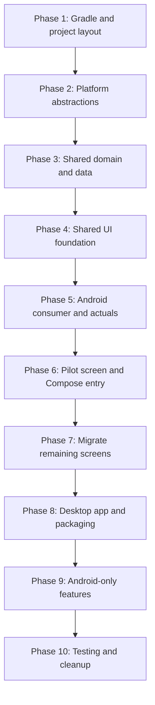

# InkWiseNote: KMP + Compose Migration Roadmap

This roadmap merges the Kotlin Multiplatform migration and the Compose UI migration into one sequence you can follow from start to finish. Each phase builds on the previous; dependencies are called out so you can track progress.

---

## Target state (reminder)

- **shared**: commonMain (domain, data, Compose UI with layout selection) + androidMain/jvmMain (expect/actual only).
- **androidApp**: Single Compose Activity; provides LayoutContext and actuals; no Activities/Fragments/RecyclerView.
- **desktopApp**: Compose Desktop window; same shared UI; provides LayoutContext and JVM actuals.
- **Layout selection**: Per-screen composable receives LayoutContext (platform, window size, later: user preference); selects Compact vs Expanded layout. Tablet and desktop share Expanded.

---

## Roadmap overview

---

## Phase 1: Gradle and project layout

**Goal:** KMP project with shared, androidApp, desktopApp; Compose Multiplatform in shared from the start.

| Task | Details                                                                                                                                                                                                                               |
| ---- | ------------------------------------------------------------------------------------------------------------------------------------------------------------------------------------------------------------------------------------- |
| 1.1  | Update root [build.gradle.kts](build.gradle.kts): add `org.jetbrains.kotlin.multiplatform`, align Kotlin version (e.g. 1.9.24+ or 2.0.x per Compose Multiplatform docs).                                                              |
| 1.2  | Update [settings.gradle.kts](settings.gradle.kts): `include(":shared", ":desktopApp")`; keep `:app` (rename to androidApp later if desired).                                                                                          |
| 1.3  | Create **shared** module with `build.gradle.kts`: `kotlin { androidTarget(); jvm() }` (or `jvm("desktop")`), source sets commonMain/androidMain/jvmMain; add SQLDelight plugin, Compose Multiplatform, kotlinx.coroutines, koin-core. |
| 1.4  | Create **desktopApp** module: JVM + Compose Desktop, `main()` with empty window; depends on `shared`.                                                                                                                                 |
| 1.5  | Make **app** depend on `shared`. Do not move code yet; just ensure the dependency compiles.                                                                                                                                           |

**Exit criteria:** `./gradlew :shared:compileShared` (or `:shared:compileDebugKotlinAndroid` and `:shared:compileKotlinJvm`) and desktopApp `run` succeed (empty window).

---

## Phase 2: Platform abstractions (expect/actual)

**Goal:** All platform-specific access goes through expect/actual in shared; no Android/JVM types in commonMain.

| Task | Details                                                                                                                                    |
| ---- | ------------------------------------------------------------------------------------------------------------------------------------------ |
| 2.1  | **App storage path**: `expect fun appStorageRoot(): String`. androidMain: from Context (inject); jvmMain: e.g. `user.home`/`.inkwisenote`. |
| 2.2  | **Logger**: `expect class PlatformLogger` with `log(level, tag, message)`. Android = `android.util.Log`; JVM = println or slf4j.           |
| 2.3  | **Secrets**: `expect class AppSecrets` (visionApiKey, visionApiEndpoint). Android = BuildConfig; JVM = env or config file.                 |
| 2.4  | **Database driver**: SQLDelight `expect fun createDriver()`. Android = AndroidSqliteDriver; JVM = JvmSqliteDriver.                         |
| 2.5  | **Background scheduler**: `expect class BackgroundScheduler` with `schedule(work)`. Android = WorkManager; JVM = CoroutineScope/executor.  |

**Exit criteria:** Shared module compiles; actuals implemented and injectable from app/desktopApp (wiring can happen in Phase 5/8).

---

## Phase 3: Shared domain and data layer

**Goal:** Domain models, SQLDelight DB, and repository logic live in commonMain; app will stop using Room after this.

| Task | Details                                                                                                                                                                                                                                         |
| ---- | ----------------------------------------------------------------------------------------------------------------------------------------------------------------------------------------------------------------------------------------------- |
| 3.1  | Move **pure Kotlin** into commonMain: functionalUtils (Either, Function, Function2; Try with PlatformLogger), common (Strings, DateTimeUtils, ListUtils, MapsUtils).                                                                            |
| 3.2  | Define **domain models** in commonMain (plain data classes): AtomicNote, SmartBook, SmartBookPage, HandwrittenNote, TextNote, Query, NoteRelation, NoteOcrText, NoteTermFrequency.                                                              |
| 3.3  | Add **SQLDelight** schema: `.sq` files under `shared/src/commonMain/sqldelight/` for all 9 tables; migrations matching current Room semantics (e.g. version 14).                                                                                |
| 3.4  | **Repository interfaces** in commonMain; **implementations** using SQLDelight + expect driver + AppStoragePath. Move logic from SmartNotebookRepository, AtomicNotesDomain, QueryRepository, HandwrittenNoteRepository, NoteRelationRepository. |
| 3.5  | Extract **TF-IDF / OCR pipeline** into commonMain (e.g. NoteTfIdfLogic1) using repository interfaces and PlatformLogger.                                                                                                                        |
| 3.6  | **Shared state**: Introduce screen state holders in commonMain that expose `Flow` (no Android ViewModel/LiveData); these will be used by Compose screens.                                                                                       |

**Exit criteria:** Shared builds; repository layer is testable from commonTest; app still uses Room (will switch in Phase 5).

---

## Phase 4: Shared UI foundation (LayoutContext + nav)

**Goal:** LayoutContext, WindowSizeClass, Platform; root nav graph in shared; both app and desktopApp can host this graph.

| Task | Details                                                                                                                                                                                                                                                                                    |
| ---- | ------------------------------------------------------------------------------------------------------------------------------------------------------------------------------------------------------------------------------------------------------------------------------------------ |
| 4.1  | In shared commonMain: define **LayoutContext** (platform, windowSizeClass), **Platform** (Android, Desktop), **WindowSizeClass** (Compact, Medium, Expanded) with width thresholds (e.g. <600dp Compact, 600–840dp Medium, >840dp Expanded).                                               |
| 4.2  | Define **root nav graph** composable in shared: takes LayoutContext, navigation state (e.g. sealed class Route), and renders current screen by calling the corresponding Screen composable with that context. Start with a single placeholder screen (e.g. "Home" or "NotebookList" stub). |
| 4.3  | **Theme**: Add a theme registry (id → ColorScheme) and apply `MaterialTheme(colorScheme = selectedScheme)` at the root of the nav graph so themes (dark/light, extensible) are supported from day one. Selection can be a simple default; user preference can be wired later.              |
| 4.4  | Document the contract: every screen composable has signature `(LayoutContext, ViewModel/State, onNavigate)`. Layout selection inside each screen: `when (context.windowSizeClass) { Compact -> XxxCompactLayout(...); else -> XxxExpandedLayout(...) }`.                                   |

**Exit criteria:** Shared Compose compiles; root nav graph + placeholder screen exist; no LayoutContext from hosts yet (Phase 5/6 will provide it).

---

## Phase 5: Android app as consumer of shared (data + actuals)

**Goal:** App uses shared data and actuals; Room removed; single Compose Activity can show the shared nav graph.

| Task | Details |
| 5.1 | Implement **actuals** in androidMain for appStorageRoot, PlatformLogger, AppSecrets, createDriver, BackgroundScheduler. Register them in Koin (shared Koin module in commonMain; app adds android-specific module with actuals). |
| 5.2 | **Replace Room in app** with SQLDelight: remove Room dependency and NotesDatabase; use shared repository implementations. Optionally implement one-time migration from existing Room DB to SQLDelight for user data. |
| 5.3 | **Koin**: Shared bindings in commonMain; app uses koin-android and koin-androidx-workmanager; register WorkManager factory and actuals. |
| 5.4 | **Compose Activity**: Add (or convert to) a single Activity that sets Compose content to the shared root nav graph. Compute **LayoutContext** from WindowMetricsCalculator (or BoxWithConstraints) and pass `Platform.Android`. Use a default route (e.g. placeholder from Phase 4). |
| 5.5 | Refactor **ViewModels**: Have Android ViewModels delegate to shared state holders (Flow); or use shared state holders directly from Compose if you do not need process-death handling in a ViewModel. |

**Exit criteria:** App runs; uses SQLDelight and shared repos; one Compose Activity shows shared nav graph with placeholder; LayoutContext is Android + current window size.

---

## Phase 6: Pilot screen and Compose entry points

**Goal:** One real screen (e.g. Notebook list) fully in Compose with Compact and Expanded layouts; Android and Desktop both show it.

| Task | Details |
| 6.1 | Pick **pilot screen** (e.g. notebook list from SmartHome or main list). Implement in shared: **NotebookListScreen**(context, state, onNavigate), **NotebookListCompactLayout**, **NotebookListExpandedLayout**. In NotebookListScreen, select layout with `when (context.windowSizeClass) { ... }`. |
| 6.2 | Connect pilot screen to **root nav graph** (add route and state holder); remove or bypass the old Activity/Fragment for this flow on Android. |
| 6.3 | **Desktop**: In desktopApp, set Compose content to the same root nav graph; compute LayoutContext from window size and `Platform.Desktop`. Confirm pilot screen works on both Android (phone + tablet) and Desktop. |
| 6.4 | Verify **theming**: switch theme (e.g. dark/light) and confirm it applies in shared root. |

**Exit criteria:** One full flow (e.g. open app → notebook list) works on Android and Desktop with correct Compact vs Expanded behavior; old UI for that flow can be removed.

---

## Phase 7: Migrate remaining screens to Compose

**Goal:** All screens implemented in shared Compose with layout selection; no Activities/Fragments/RecyclerView left.

| Task | Details |
| 7.1 | For each remaining screen (SmartNotebook, Note detail, Search, Queries, Admin, File explorer, Related notes, etc.): add **XxxScreen**(context, state, onNavigate), **XxxCompactLayout** and **XxxExpandedLayout**; in XxxScreen use context.windowSizeClass (and context.platform only when needed) to choose layout. |
| 7.2 | **Navigation**: Replace Activity-based navigation with a single Compose navigation (sealed Route, back stack in shared). All navigation goes through onNavigate; no platform-specific navigation in screen code. |
| 7.3 | **Platform-only UI**: expect/actual for back affordance, file picker, toast/snackbar. **DrawingView** (handwriting): implement in Compose in shared or behind expect/actual with shared interface. |
| 7.4 | **Remove legacy UI**: Delete or stub old Activities, Fragments, RecyclerView adapters, and related resources once each screen is migrated and tested. |

**Exit criteria:** App and Desktop run entirely from shared Compose; no remaining Activity/Fragment UI.

---

## Phase 8: Desktop app (actuals and packaging)

**Goal:** Desktop runs with same UI and data; distributable for Windows and Linux.

| Task | Details |
| 8.1 | Implement **jvmMain actuals**: appStorageRoot (e.g. user.home/.inkwisenote), PlatformLogger, AppSecrets (env), createDriver (JVM SQLite), BackgroundScheduler (coroutines). Register in Koin for desktop. |
| 8.2 | **Packaging**: Use Compose Desktop distribution (e.g. `jlink` or native installers) to produce runnable JAR or installers for Windows and Linux. |
| 8.3 | **Platform quirks**: File path separators, any OS-specific behavior in jvmMain. |

**Exit criteria:** Desktop app runs with full flows; installers/JAR build and run on Windows and Linux.

---

## Phase 9: Android-only and optional features

**Goal:** ML Kit, OCR, GMS isolated to Android; desktop has clear no-op or alternatives.

| Task | Details |
| 9.1 | **ML Kit digital ink**: Keep in androidApp/androidMain; expose via expect interface; desktop actual returns "unsupported" or no-op. |
| 9.2 | **Tess-two / OCR**: Same pattern; desktop actual no-op or alternative OCR if desired. |
| 9.3 | **GMS**: Remove from shared; keep only in Android source sets where needed. |
| 9.4 | **WorkManager**: Used only in Android actual of BackgroundScheduler; not referenced in commonMain. |

**Exit criteria:** Shared has no Android-only dependencies; desktop builds and runs without those features.

---

## Phase 10: Testing and cleanup

**Goal:** Tests updated; dead code and legacy resources removed.

| Task | Details |
| 10.1 | **Shared unit tests**: commonTest for repositories, TF-IDF, utils; optionally androidTest/jvmTest for actuals. |
| 10.2 | **Android**: Update instrumented tests to use shared DB and Compose; remove tests for deleted Activities/Fragments. |
| 10.3 | **Desktop**: Basic run configuration and minimal tests if needed. |
| 10.4 | **Cleanup**: Remove deprecated Room entities/DAOs from app (if any leftover references), duplicate utils, and unused resources. |

**Exit criteria:** Key flows covered by tests; no leftover legacy UI or Room code.

---

## Summary: phase order and dependencies

| Phase | Name                           | Depends on                                            |
| ----- | ------------------------------ | ----------------------------------------------------- |
| 1     | Gradle and project layout      | —                                                     |
| 2     | Platform abstractions          | 1                                                     |
| 3     | Shared domain and data         | 2                                                     |
| 4     | Shared UI foundation           | 1, 2 (shared compiles)                                |
| 5     | Android consumer and actuals   | 2, 3, 4                                               |
| 6     | Pilot screen and Compose entry | 4, 5                                                  |
| 7     | Migrate remaining screens      | 6                                                     |
| 8     | Desktop app and packaging      | 2, 3, 4, 6 (desktop can follow 5 in parallel after 4) |
| 9     | Android-only features          | 5, 8                                                  |
| 10    | Testing and cleanup            | 7, 8, 9                                               |

**Suggested execution:** Do phases 1–4 in order. After 4, you can do 5 and 6 (Android + pilot screen), then 7 (remaining screens), while doing 8 (desktop) in parallel with 6/7 if desired. Then 9 and 10.

---

## Extensibility (themes and layout preference)

The roadmap already sets up extensibility you asked for earlier:

- **Themes:** Phase 4 introduces a theme registry and MaterialTheme at root; add user preference (stored via settings) and optionally theme packs later without changing the layout-selection design.
- **Layout by user preference:** Extend LayoutContext with a per-page user preference (e.g. `userLayoutPreference: (Page) -> LayoutVariant?`); in each screen’s selector, use “preference for this page ?? size-based default.” No change to phase order.
- **External theme/layout packs:** Load themes into the same registry; for layouts, “available layouts per page” (built-in + from pack) can be added to LayoutContext and the same per-screen selector can respect it.

These can be added after Phase 7 or 10 without redoing the roadmap.