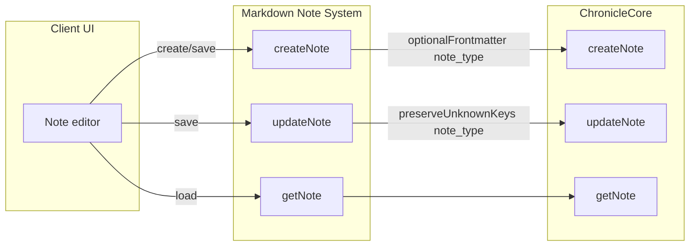

# Markdown Note System – Phased Implementation Plan

## Context

ChronicleCore already persists notes as markdown files with frontmatter ([ChronicleCore.kt](shared/src/commonMain/kotlin/org/basnalcorp/shared/systems/chroniclecore/ChronicleCore.kt)). It supports:

- `createNote(notebookId, title, body, optionalFrontmatter, optionalNoteId)` 
- `updateNote(noteId, notebookId, updatedTitle, updatedBody, expectedLastModified, preserveUnknownKeys)`
- `getNote(notebookId, noteId)` returning [ChronicleNoteContent](shared/src/commonMain/kotlin/org/basnalcorp/shared/systems/chroniclecore/ChronicleTypes.kt) (body + unknownFrontmatter)

[Frontmatter.kt](shared/src/commonMain/kotlin/org/basnalcorp/shared/systems/chroniclecore/Frontmatter.kt) preserves any key other than `creation_time`, `last_modified`, and `title` in `unknownKeys`; no changes needed there.

---

## Phase 1: Core Markdown note system ✅

**Goal:** Add the system that ensures `note_type` in frontmatter and delegates all persistence to ChronicleCore.

**1.1 Package and types**

- Create package `org.basnalcorp.shared.systems.markdownnote` under `shared/src/commonMain/kotlin/`.
- Add a **MarkdownNoteContent** type (optional but useful for a clean read API later):
  - Fields: `noteId`, `notebookId`, `title`, `body`, `noteType`, `creationTime`, `lastModified`.
  - Built from `ChronicleNoteContent` by taking `body`, `title`, `creationTime`, `lastModified` and `noteType = unknownFrontmatter["note_type"] ?: "markdown"`.

**1.2 MarkdownNoteSystem API**

- Add **MarkdownNoteSystem** (class or interface + impl) that depends only on **ChronicleCore**.
- **createNote(notebookId, title, body, noteType = "markdown")**:  
Call `ChronicleCore.createNote(notebookId, title, body, optionalFrontmatter = mapOf("note_type" to noteType))`.  
Return `ChronicleCommandResult<ChronicleNoteContent>` (or a thin wrapper).
- **updateNote(noteId, notebookId, title, body, expectedLastModified, noteType = "markdown")**:  
Call `ChronicleCore.updateNote(noteId, notebookId, title, body, expectedLastModified, preserveUnknownKeys = mapOf("note_type" to noteType))`.  
Return `ChronicleCommandResult<ChronicleNoteContent>`.

**1.3 Implementation**

- Single class `MarkdownNoteSystem` (or `MarkdownNoteSystemImpl`) constructor: `(chronicleCore: ChronicleCore)`.
- No new dependencies; no changes to ChronicleCore or Frontmatter.

**Deliverables:** New package with `MarkdownNoteContent` (if used), `MarkdownNoteSystem`, and tests that it adds `note_type` and delegates correctly.

---

## Phase 2: DI and read API ✅

**2.1 Read API (optional)**

- **getNote(notebookId, noteId)**: Call `ChronicleCore.getNote(notebookId, noteId)`; map result to `MarkdownNoteContent` using `unknownFrontmatter["note_type"] ?: "markdown"`. Return `MarkdownNoteContent?`.

**2.2 DI registration**

- Register **MarkdownNoteSystem** in the same modules that provide **ChronicleCore**:
  - [DesktopActualsModule](desktopApp/src/main/kotlin/com/originb/inkwisenote2/desktop/DesktopActualsModule.kt) (and any other desktop module that creates ChronicleCore).
  - [SharedActualsModule](androidApp/src/main/java/com/originb/inkwisenote2/di/SharedActualsModule.kt) (Android).
- Constructor: `MarkdownNoteSystem(get())` so it receives the existing ChronicleCore singleton.

**Deliverables:** `getNote` on MarkdownNoteSystem (if desired), DI bindings for desktop and Android, and any tests for the read path.

---

## Phase 3: Client integration ✅

**Goal:** Have the UI create and save markdown notes via MarkdownNoteSystem instead of calling ChronicleCore directly.

**3.1 Integration points**

- **Create note:** When the user adds a new markdown note from a Chronicle-backed notebook screen (e.g. future "add note" on [InitNoteScreen](shared/src/commonMain/kotlin/org/basnalcorp/shared/ui/screen/InitNoteScreen.kt) or a dedicated Chronicle notebook detail screen), the client calls `MarkdownNoteSystem.createNote(notebookId, title, body, noteType = "markdown")` and then navigates to the editor or refreshes the list.
- **Save note:** When the user saves from the note editor, the client calls `MarkdownNoteSystem.updateNote(noteId, notebookId, title, body, expectedLastModified, noteType = "markdown")`. Use `lastModified` from the last loaded content as `expectedLastModified` (or implement optimistic locking later).
- **Load note:** When opening a note for editing, the client can use `ChronicleCore.getNote(notebookId, noteId)` as today, or `MarkdownNoteSystem.getNote(notebookId, noteId)` if Phase 2 read API was added, and read `note_type` from the returned content.

**3.2 Scope for this phase**

- Inject **MarkdownNoteSystem** where needed (e.g. state holder or screen that will host "add note" / "save note").
- Implement the "add markdown note" action (e.g. button on Chronicle notebook page) that calls `MarkdownNoteSystem.createNote` and then opens the new note (or stays on list).
- Implement the "save" action in the note editor that calls `MarkdownNoteSystem.updateNote` with current title, body, and `expectedLastModified`.

**3.3 Out of scope for initial plan**

- Full Chronicle notebook detail screen (list of notes, open/delete) can be a follow-up.
- Handwritten or other note types remain separate systems; only markdown flows go through MarkdownNoteSystem.

**Deliverables:** UI calls MarkdownNoteSystem for create and save; new notes get `note_type: "markdown"` in frontmatter; no direct ChronicleCore create/update from the main app flow for markdown.

---

## Summary

| Phase | Focus       | Outcome                                                                                             | Status   |
| ----- | ----------- | --------------------------------------------------------------------------------------------------- | -------- |
| 1     | Core system | MarkdownNoteSystem with createNote/updateNote, note_type in frontmatter, delegates to ChronicleCore | ✅ Done  |
| 2     | DI + read   | getNote (optional), MarkdownNoteSystem registered in desktop and Android modules                    | ✅ Done  |
| 3     | Client      | Add/save markdown notes from UI via MarkdownNoteSystem                                              | ✅ Done  |

No changes to ChronicleCore or Frontmatter are required; the system is a thin layer that adds and preserves `note_type` and delegates all persistence to ChronicleCore.
