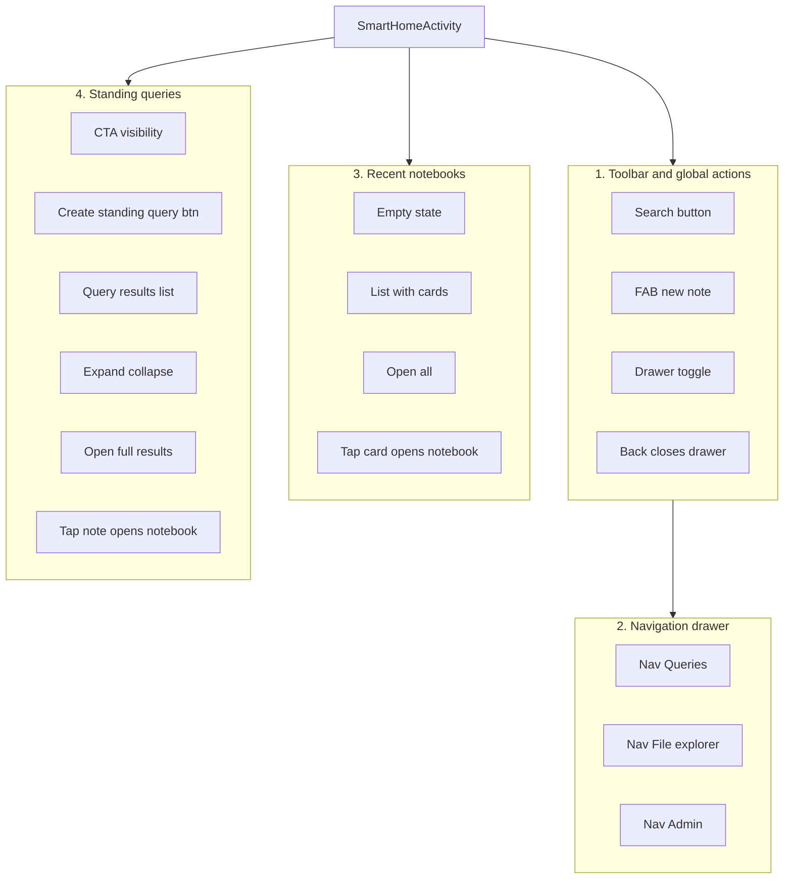

# Smart Home Module – UI Test Plan

## Scope

Target: [androidApp/src/main/java/com/originb/inkwisenote2/modules/smarthome/](androidApp/src/main/java/com/originb/inkwisenote2/modules/smarthome/) and the single screen it owns, **SmartHomeActivity**, which is the app home (dashboard). The screen shows:

- **Toolbar**: app title, search, and drawer toggle
- **Recent notebooks**: horizontal list (RecyclerView) of user notebooks with “Open all” and optional empty-state prompt
- **Standing queries**: CTA to create queries and a vertical list of query result sections (each expandable, with note rows that open the notebook)

Layout: [androidApp/src/main/res/layout/activity_smart_home.xml](androidApp/src/main/res/layout/activity_smart_home.xml). Key view IDs used below: `drawer_layout`, `toolbar`, `search_button`, `add_new_note_btn`, `nav_view`, `take_notes_prompt`, `created_by_user_text`, `open_all_notebooks`, `user_created_notebooks`, `add_standing_queries_msg`, `create_standing_query_btn`, `queried_notes_text`, `queried_notes`.

---

## Test structure and conventions

- **Runner**: Instrumented tests in `androidApp/src/androidTest/`, using `AndroidJUnit4`, `ActivityScenarioRule<SmartHomeActivity>` (or launch via `openSmartHomePageAndStartFresh` for a clean task).
- **Style**: Scenario-based names and Given/When/Then comments; one user interaction scenario per test where possible.
- **Isolation**: Use in-memory or test-specific data where feasible (reuse patterns from [SmartNotebookActivityTest](androidApp/src/androidTest/java/com/originb/inkwisenote2/activities/SmartNotebookActivityTest.kt) and [NoteTextDaoTest](androidApp/src/test/java/com/originb/inkwisenote2/io/sql/NoteTextDaoTest.kt)). Consider Koin test modules to inject fakes for `SmartNotebookRepository` / `QueryRepository` so dashboard state is predictable.
- **Location**: New test class(es) under `androidApp/src/androidTest/java/com/originb/inkwisenote2/modules/smarthome/` (e.g. `SmartHomeActivityTest.kt` or split by feature group).

---

## Feature groups and test cases

### 1. Toolbar and global actions

| #   | Scenario                            | Steps                         | Expected                                                                  | View IDs / notes                                                                                                                            |
| --- | ----------------------------------- | ----------------------------- | ------------------------------------------------------------------------- | ------------------------------------------------------------------------------------------------------------------------------------------- |
| 1.1 | Search opens search screen          | Launch Smart Home, tap search | NoteSearchActivity is shown (e.g. assert search-related view or activity) | `search_button`                                                                                                                             |
| 1.2 | FAB opens new note                  | Tap FAB                       | SmartNotebookActivity started (new note flow)                             | `add_new_note_btn`                                                                                                                          |
| 1.3 | Drawer opens from toolbar           | Tap toolbar drawer toggle     | Drawer opens (nav drawer visible)                                         | DrawerLayout + toggle from ActionBarDrawerToggle                                                                                            |
| 1.4 | Back with drawer open closes drawer | Open drawer, press back       | Drawer closes, activity remains                                           | `onBackPressed()` behavior in [SmartHomeActivity](androidApp/src/main/java/com/originb/inkwisenote2/modules/smarthome/SmartHomeActivity.kt) |

### 2. Navigation drawer

| #   | Scenario                               | Steps                          | Expected                                    | View IDs / notes                                         |
| --- | -------------------------------------- | ------------------------------ | ------------------------------------------- | -------------------------------------------------------- |
| 2.1 | Queries item opens query screen        | Open drawer, tap “Queries”     | QueryCreationActivity (or query list) shown | `nav_view`, `R.id.nav_queries`                           |
| 2.2 | File explorer item opens file explorer | Open drawer, tap file explorer | DirectoryExplorerActivity shown             | `R.id.nav_file_explorer`                                 |
| 2.3 | Admin item opens admin                 | Open drawer, tap admin         | AdminActivity shown                         | `R.id.admin_button`                                      |
| 2.4 | Drawer closes after navigation         | Open drawer, tap any nav item  | Drawer closes and target activity is shown  | `drawer_layout.closeDrawer(GravityCompat.START)` in code |

### 3. Recent notebooks (empty and populated)

| #   | Scenario                         | Steps                                                               | Expected                                                                        | View IDs / notes                                                                                                                                                                     |
| --- | -------------------------------- | ------------------------------------------------------------------- | ------------------------------------------------------------------------------- | ------------------------------------------------------------------------------------------------------------------------------------------------------------------------------------ |
| 3.1 | Empty state when no notebooks    | Launch with no user notebooks (e.g. clean state / faked empty repo) | “Take notes” prompt visible; “Created by user” and “Open all” hidden            | `take_notes_prompt` visible; `created_by_user_text`, `open_all_notebooks` gone or not displayed                                                                                      |
| 3.2 | Notebooks list when data exists  | Launch with at least one notebook (pre-seed or test DB)             | “Created by user” and “Open all” visible; horizontal list has at least one card | `user_created_notebooks`, [SmartNoteGridAdapter](androidApp/src/main/java/com/originb/inkwisenote2/modules/smartnotes/ui/SmartNoteGridAdapter.kt)                                    |
| 3.3 | Open all notebooks               | With notebooks visible, tap “Open all”                              | NoteSearchActivity with “show all notebooks” (intent extra or list visible)     | `open_all_notebooks`                                                                                                                                                                 |
| 3.4 | Tap notebook card opens notebook | With notebooks visible, tap first notebook card                     | SmartNotebookActivity with correct bookId (intent or screen content)            | Card in `user_created_notebooks`; [GridNoteCardHolder](androidApp/src/main/java/com/originb/inkwisenote2/modules/smartnotes/ui/GridNoteCardHolder.kt) opens via `openNotebookIntent` |

### 4. Standing queries section (empty and populated)

| #   | Scenario                                                | Steps                                                    | Expected                                                                              | View IDs / notes                                                                                                                                                                                   |
| --- | ------------------------------------------------------- | -------------------------------------------------------- | ------------------------------------------------------------------------------------- | -------------------------------------------------------------------------------------------------------------------------------------------------------------------------------------------------- |
| 4.1 | No CTA when no notebooks                                | Launch with no notebooks                                 | “Create standing query” button hidden; optional “add standing queries” message hidden | `create_standing_query_btn`, `add_standing_queries_msg`; logic in [SmartHomeActivity](androidApp/src/main/java/com/originb/inkwisenote2/modules/smarthome/SmartHomeActivity.kt) (QueriedNotebooks) |
| 4.2 | CTA visible when notebooks exist and no queries         | Launch with notebooks, no standing queries               | “Add standing queries” message and “Create Standing Query” button visible             | `add_standing_queries_msg`, `create_standing_query_btn`                                                                                                                                            |
| 4.3 | Create standing query button opens query screen         | Tap “Create Standing Query”                              | QueryCreationActivity shown                                                           | `create_standing_query_btn` → `openQueryActivity`                                                                                                                                                  |
| 4.4 | Query results section visible when queries have results | Launch with at least one standing query that has matches | “Queried notes” label and queried results list visible                                | `queried_notes_text`, `queried_notes`; [QueryResultsAdapter](androidApp/src/main/java/com/originb/inkwisenote2/modules/smarthome/QueryResultsAdapter.kt)                                           |
| 4.5 | Expand/collapse query section                           | With query results shown, tap toggle on first section    | First section expands or collapses (RecyclerView visibility / drawable change)        | `query_results_toggle` in [QueryResultsAdapter.QueryViewHolder](androidApp/src/main/java/com/originb/inkwisenote2/modules/smarthome/QueryResultsAdapter.kt)                                        |
| 4.6 | Open full query results                                 | Tap “expand” / open button on a query row                | QueryResultsActivity with that query name                                             | `open_query_results_btn` → `openQueryResultsActivity`                                                                                                                                              |
| 4.7 | Tap note in query results opens notebook                | With query results expanded, tap a note row              | SmartNotebookActivity with query context (bookTitle, noteIds, selectedNoteId)         | [NotesAdapter](androidApp/src/main/java/com/originb/inkwisenote2/modules/smarthome/NotesAdapter.kt) item click → `openNotebookIntent`                                                              |

### 5. Data and state (optional / if feasible)

| #   | Scenario                                                    | Steps                                      | Expected                                            | Notes                                                         |
| --- | ----------------------------------------------------------- | ------------------------------------------ | --------------------------------------------------- | ------------------------------------------------------------- |
| 5.1 | After creating a note, home shows it                        | Create note from FAB, return to Smart Home | Recent notebooks list includes the new notebook     | Requires navigation back; may use Intents or state assertions |
| 5.2 | After adding a standing query with matches, section appears | Add query, return to Smart Home            | Queried section for that query appears with results | Depends on test data and EventBus/ViewModel refresh           |

---

## Implementation todos (grouped by type and feature)

### User Stories (features directly used by the user)

| Feature                      | Test cases                                                                                                                                                                                                                                 | Class / location                          |
| ---------------------------- | ------------------------------------------------------------------------------------------------------------------------------------------------------------------------------------------------------------------------------------------ | ----------------------------------------- |
| **Toolbar & global actions** | 1.1 Search opens search screen; 1.2 FAB opens new note; 1.3 Drawer opens from toolbar; 1.4 Back with drawer open closes drawer                                                                                                             | `SmartHomeToolbarUserStoriesTest`         |
| **Navigation drawer**        | 2.1 Queries item opens query screen; 2.2 File explorer opens; 2.3 Admin opens; 2.4 Drawer closes after navigation                                                                                                                          | `SmartHomeDrawerUserStoriesTest`          |
| **Recent notebooks**         | 3.1 Empty state when no notebooks; 3.2 Notebooks list when data exists; 3.3 Open all notebooks; 3.4 Tap notebook card opens notebook                                                                                                       | `SmartHomeRecentNotebooksUserStoriesTest` |
| **Standing queries**         | 4.1 No CTA when no notebooks; 4.2 CTA visible when notebooks exist; 4.3 Create standing query opens query screen; 4.4 Query results section visible; 4.5 Expand/collapse section; 4.6 Open full query results; 4.7 Tap note opens notebook | `SmartHomeStandingQueriesUserStoriesTest` |
| **Data & state (optional)**  | 5.1 Home shows new note after create; 5.2 Query section appears after adding query                                                                                                                                                         | `SmartHomeDataUserStoriesTest` (optional) |

### Edge Cases (unexpected errors and boundary conditions)

| Feature              | Test cases                                                                                                     | Class / location                        |
| -------------------- | -------------------------------------------------------------------------------------------------------------- | --------------------------------------- |
| **Toolbar & drawer** | Rapid back with drawer open does not crash; drawer closes cleanly                                              | `SmartHomeToolbarDrawerEdgeCasesTest`   |
| **Recent notebooks** | Open all not available when no notebooks (button hidden); no crash on empty list; list scrolls with many items | `SmartHomeRecentNotebooksEdgeCasesTest` |
| **Standing queries** | Expand/collapse when no results; multiple sections expand/collapse; no crash when tapping with empty adapter   | `SmartHomeStandingQueriesEdgeCasesTest` |

### Implementation tasks

- **Test utils**: `SmartHomeTestLauncher` (launch with clear task), `SmartHomeDrawerHelper` (open/close, tap nav item), `SmartHomeRecyclerViewHelper` (tap at position, scroll to position), shared matchers for view visibility.
- **File structure**: `androidTest/java/.../modules/smarthome/` — `utils/` for shared helpers; `userstories/` for User Story test classes; `edgecases/` for Edge Case test classes (or flat with naming suffix).

---

## Grouping and test classes

- **Option A (single class)**: One `SmartHomeActivityTest` with inner or annotated groups (e.g. `@Category` or naming prefix) for: Toolbar, Drawer, RecentNotebooks, StandingQueries, OptionalState.
- **Option B (split by feature)**: Multiple classes under the same package:
  - `SmartHomeToolbarTest` (1.x, 2.x)
  - `SmartHomeRecentNotebooksTest` (3.x)
  - `SmartHomeStandingQueriesTest` (4.x)
  - Optionally `SmartHomeNavigationTest` for 1.x + 2.x combined.

**Chosen structure**: Split by **User Stories** vs **Edge Cases**, and by feature (Toolbar, Drawer, Recent notebooks, Standing queries). Shared utils in `utils/` package under `modules/smarthome`.

---

## Implementation notes

- **Launch**: Use `ActivityScenario.launch(Intent(context, SmartHomeActivity::class.java))` with `FLAG_ACTIVITY_NEW_TASK | FLAG_ACTIVITY_CLEAR_TASK` to mimic `openSmartHomePageAndStartFresh`, or use a test rule that starts the activity the same way.
- **RecyclerView**: Use `Espresso.onView(withId(R.id.user_created_notebooks)).perform(RecyclerViewActions.actionOnItemAtPosition(0, click()))` (and similarly for `queried_notes`); ensure item is in view (scroll if needed). For nested RecyclerViews in query results, target the specific row (e.g. first item in the first group).
- **Drawer**: Open with `onView(withId(R.id.drawer_layout)).perform(DrawerActions.open())` (Espresso drawer actions) or by triggering the toolbar navigation icon; then match `nav_view` and perform click on menu items by ID or text.
- **Seeding data**: For 3.2, 3.4, 4.2, 4.4–4.7, either (a) use a test database/repository that you seed before launch, or (b) perform real flows (create note, create query) in a preceding test or `@Before` and then assert on Smart Home. Prefer (a) for speed and stability.
- **Idling**: If ViewModel or EventBus updates the UI asynchronously, use IdlingResource or `Espresso.onIdle()` / wait for specific view state (e.g. `created_by_user_text` visible) before asserting.

---

## Summary diagram

This plan keeps tests readable by grouping by feature, uses your existing view IDs and navigation patterns, and aligns with the current Espresso/ActivityScenario setup in the project.