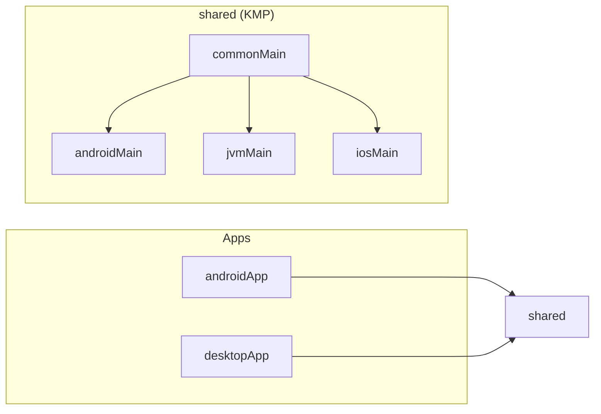
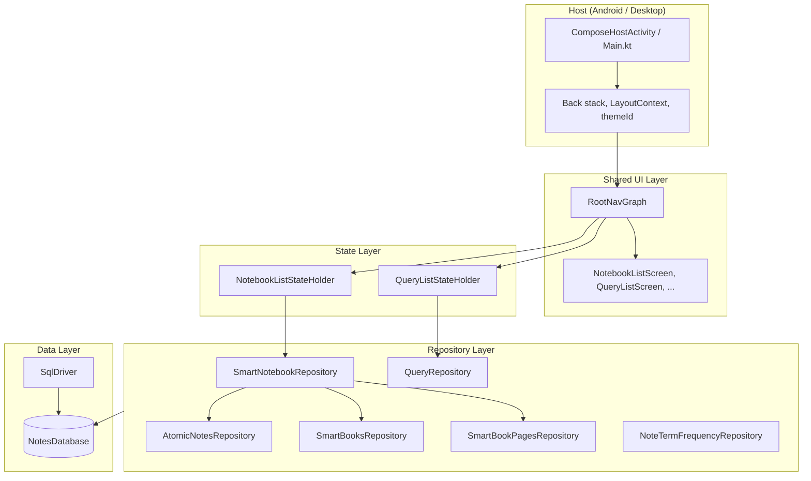
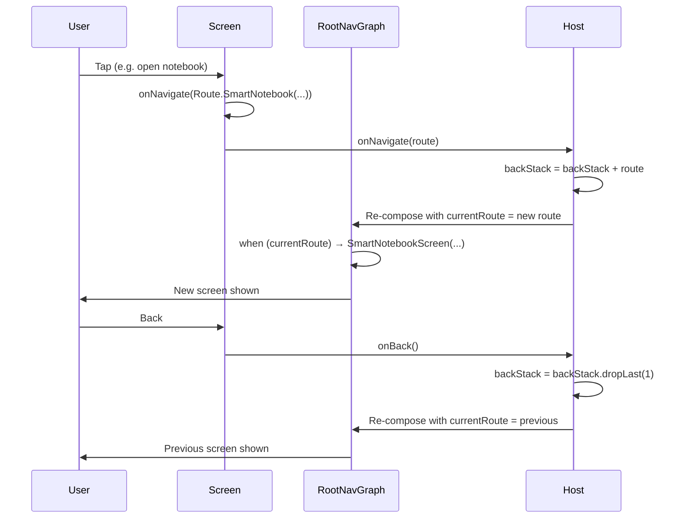
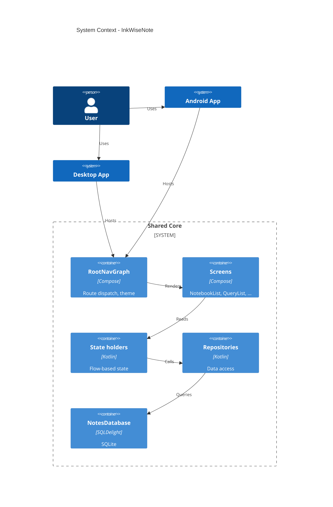
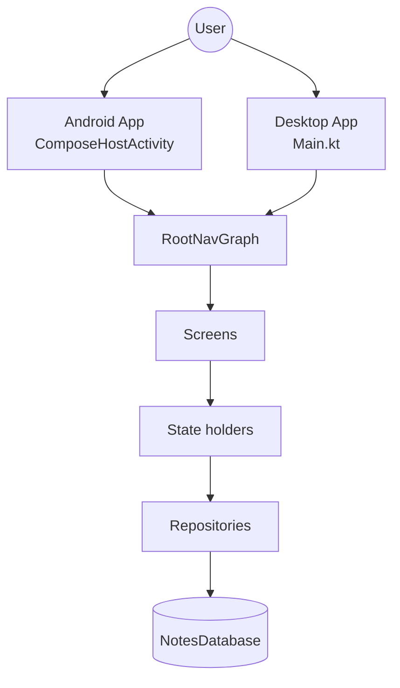
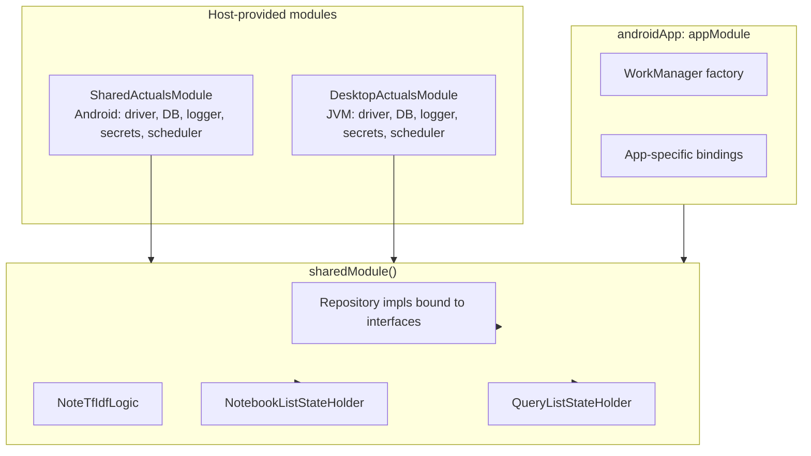
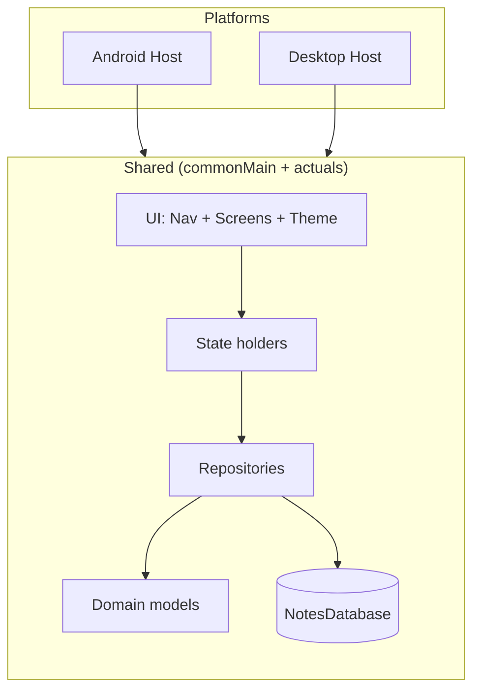

# InkWiseNote Architecture

This document describes the architecture of **InkWiseNote**, a Kotlin Multiplatform (KMP) note-taking application with shared Compose UI, SQLDelight persistence, and platform-specific implementations for Android and Desktop.

---

## 1. Overview

InkWiseNote is built as a **shared core** (`shared` module) consumed by two app modules:

- **androidApp** — Android application (Compose host Activity, Koin, platform actuals).
- **desktopApp** — Compose for Desktop (JVM), same shared UI and business logic.

The shared module contains domain models, repositories, SQLDelight database, state holders, and the full Compose UI (screens, navigation, theme). The host on each platform owns the navigation back stack and provides a `LayoutContext` (platform + window size class) so screens can adapt layout (Compact / Medium / Expanded) and platform-specific behavior (e.g. back, file picker).

---

## 2. Module Dependencies



| Module     | Role                                                                 |
|-----------|----------------------------------------------------------------------|
| **shared** | Kotlin Multiplatform library: common logic + expect/actual per platform. |
| **androidApp** | Android application; depends on `:shared`; provides Android actuals and Compose host. |
| **desktopApp** | Desktop (JVM) application; depends on `:shared`; provides JVM actuals and Compose window. |

---

## 3. Shared Module: Layer Stack

Data and UI flow from host → shared UI → state holders → repositories → database. Dependency injection (Koin) wires repositories and state holders; the host provides the database driver and platform-specific implementations.



**Responsibilities:**

- **Host**: Owns back stack (`List<Route>`), builds `LayoutContext(Platform, WindowSizeClass)`, applies theme; calls `RootNavGraph` with `currentRoute`, `onNavigate`, `onBack`, and optional state holders.
- **RootNavGraph**: Applies `ThemeRegistry.get(themeId)`, then dispatches to the correct screen composable by `currentRoute`.
- **Screens**: Follow the [Screen contract](#6-screen-contract); use `LayoutContext.windowSizeClass` for layout (Compact/Medium/Expanded); call `onNavigate(route)` to navigate.
- **State holders**: Expose `Flow<T>` (e.g. `notebooks`, `queries`); screens collect via `LaunchedEffect` and local state.
- **Repositories**: Interfaces in `data/repository/`, implementations in `data/repository/impl/`; use `NotesDatabase` (SQLDelight).
- **NotesDatabase**: SQLDelight-generated API over SQLite; driver is created by platform (expect/actual `createDriver()`).

---

## 4. Source Sets and Expect/Actual

Shared code lives in `commonMain`; platform-specific implementations live in `androidMain`, `jvmMain`, and `iosMain`. The diagram below shows how expect declarations in common are fulfilled per platform.

```mermaid
flowchart TB
    subgraph commonMain["commonMain (expect)"]
        E1[appStorageRoot]
        E2[createDriver]
        E3[PlatformLogger]
        E4[AppSecrets]
        E5[BackgroundScheduler]
        E6[platform]
        E7[isDrawingSupported]
        E8[RecognitionFactory]
    end

    subgraph androidMain["androidMain (actual)"]
        A1[AppStorage]
        A2[DatabaseDriver]
        A3[PlatformLogger]
        A4[AppSecrets]
        A5[BackgroundScheduler]
        A6[Platform.Android]
        A7[DrawingSupport]
        A8[ML Kit / Tess-two]
    end

    subgraph jvmMain["jvmMain (actual)"]
        J1[AppStorage]
        J2[DatabaseDriver]
        J3[PlatformLogger]
        J4[AppSecrets]
        J5[BackgroundScheduler]
        J6[Platform.Desktop]
        J7[No drawing]
        J8[NoOp recognition]
    end

    E1 --> A1
    E1 --> J1
    E2 --> A2
    E2 --> J2
    E3 --> A3
    E3 --> J3
    E4 --> A4
    E4 --> J4
    E5 --> A5
    E5 --> J5
    E6 --> A6
    E6 --> J6
    E7 --> A7
    E7 --> J7
    E8 --> A8
    E8 --> J8
```



| Expect (commonMain)        | Android actual              | JVM/Desktop actual        |
|---------------------------|----------------------------|---------------------------|
| `appStorageRoot()`        | Context-based path         | e.g. `user.home/.inkwisenote` |
| `createDriver()`          | `AndroidSqliteDriver`      | `JvmSqliteDriver`         |
| `PlatformLogger`          | Android Log                | stdout / custom           |
| `AppSecrets`              | BuildConfig / setter       | Env or setter             |
| `BackgroundScheduler`     | WorkManager / Coroutines   | Coroutines                |
| `platform()`              | `"Android"`                | `"Desktop"`               |
| `isDrawingSupported()`    | `true`                     | `false`                   |
| Digital ink / OCR         | ML Kit, Tess-two           | NoOp                      |

The host (e.g. `InkWiseApplication`) must call `setAppStorageRoot(context)` and `setDriverContext(context)` on Android before Koin starts so that the database and storage paths are available.

---

## 5. Navigation Flow

Navigation is **host-owned**: the host keeps a back stack (`List<Route>`) and passes `currentRoute = backStack.last()`, `onNavigate`, and `onBack` into shared UI. There is no NavController in shared code.



**Route** (sealed class) covers all destinations:

- `Home`, `Search`, `QueryList`, `QueryResults(queryName)`, `QueryCreation`
- `SmartNotebook(bookId, workingPath, bookTitle, noteIds, selectedNoteId)`
- `NoteDetail(bookId, noteId, isHandwritten)`
- `Admin`, `FileExplorer(initialPath?)`, `RelatedNotes(bookId)`

---

## 6. Screen Contract

Every shared screen composable follows the same contract so that layout and navigation are consistent across Android and Desktop.

```mermaid
flowchart LR
    subgraph Contract["Screen contract"]
        LC[LayoutContext]
        SH[State / StateHolder]
        ON[onNavigate: Route -> Unit]
        OB[onBack: () -> Unit]
    end

    subgraph LayoutContext
        P[platform: Platform]
        W[windowSizeClass: WindowSizeClass]
    end

    subgraph WindowSizeClass
        C[Compact < 600dp]
        M[Medium 600-840dp]
        E[Expanded > 840dp]
    end

    LC --> P
    LC --> W
    W --> C
    W --> M
    W --> E
```

- **LayoutContext**: Provided by the host. Contains `platform` (Android/Desktop) and `windowSizeClass` (Compact / Medium / Expanded). Screens use it to choose layout and platform-specific UI (e.g. back button).
- **State**: Screen-specific state or state holder (e.g. `NotebookListStateHolder`). No Android ViewModel/LiveData in shared; state holders expose `Flow` and screens collect into local Compose state.
- **onNavigate(route)**: Callback to request navigation; host pushes the route onto the back stack.
- **onBack()**: Callback to pop the back stack (for non-root screens).

Layout selection inside each screen:

```kotlin
when (context.windowSizeClass) {
    WindowSizeClass.Compact -> XxxCompactLayout(...)
    WindowSizeClass.Medium  -> XxxMediumLayout(...)   // optional
    WindowSizeClass.Expanded -> XxxExpandedLayout(...)
}
```

---

## 7. Component Interaction (C4-style)

A high-level view of how the main components interact:



*(Note: If your viewer does not support C4Context, the following diagram is an alternative.)*



---

## 8. Data Flow (State Holders → Repositories → DB)

Screens that need list data receive a state holder from the host (injected via Koin and passed into `RootNavGraph`). State holders expose `Flow<T>`; screens use `LaunchedEffect(stateHolder)` and collect into `mutableStateOf` for Compose.

```mermaid
flowchart LR
    subgraph Screen
        LE[LaunchedEffect]
        MS[mutableStateOf]
        LE --> MS
    end
    subgraph StateHolder["State holder (e.g. NotebookListStateHolder)"]
        F[Flow list]
    end
    subgraph Repo["Repository"]
        getAll[getAll]
    end
    subgraph DB[(NotesDatabase)]
    end

    F --> LE
    Repo --> F
    getAll --> DB
```

Example: `NotebookListStateHolder(smartNotebookRepository)` exposes `notebooks: Flow<List<SmartNotebook>>`; `NotebookListScreen` collects this flow and displays the list. Repository implementations use `NotesDatabase` and SQLDelight queries.

---

## 9. Database Schema (SQLDelight)

The shared database is **NotesDatabase** (package `org.basnalcorp.shared.db`). Tables are defined in `.sq` files under `shared/src/commonMain/sqldelight/org/basnalcorp/shared/db/`.

```mermaid
erDiagram
    smart_books ||--o{ smart_book_pages : "has pages"
    smart_books ||--o{ atomic_note_entities : "references"
    smart_book_pages }o--|| atomic_note_entities : "references note"
    handwritten_notes ||--o| note_text : "optional OCR"
    text_notes ||--o| note_text : "content"
    atomic_note_entities }o--|| handwritten_notes : "or"
    atomic_note_entities }o--|| text_notes : "or"
    note_term_frequency }o--o| atomic_note_entities : "per note"
    note_relation }o--o| atomic_note_entities : "relations"
    queries ||--o{ note_term_frequency : "search"

    smart_books {
        long book_id PK
        string title
        long created_time
        long last_modified_time
    }

    smart_book_pages {
        long id PK
        long book_id FK
        long note_id FK
        int page_order
    }

    atomic_note_entities {
        long note_id PK
        string filename
        string filepath
        string note_type
        long page_template_id
        long created_time
        long last_modified_time
    }

    handwritten_notes {
        long note_id PK
        long book_id FK
        string filepath
        ...
    }

    text_notes {
        long note_id PK
        long book_id FK
        string text
        ...
    }

    note_text {
        long note_id PK
        string ocr_text
    }

    queries {
        string name PK
        string words_to_find
        string words_to_ignore
        long created_time
    }

    note_term_frequency {
        long note_id FK
        string term
        real frequency
        ...
    }

    note_relation {
        long source_note_id FK
        long target_note_id FK
        string relation_type
    }
```

**Tables:** `smart_books`, `smart_book_pages`, `atomic_note_entities`, `handwritten_notes`, `text_notes`, `note_text`, `queries`, `note_term_frequency`, `note_relation`. Domain models (e.g. `SmartNotebook`, `SmartBook`, `Query`) are plain Kotlin data classes in `shared/.../domain/` and map from these tables via repositories.

---

## 10. Dependency Injection (Koin)



- **sharedModule()** (in `shared/di/SharedKoinModule.kt`): Binds repository implementations to interfaces, registers `NoteTfIdfLogic`, `NotebookListStateHolder`, and `QueryListStateHolder`. Depends on the host providing `NotesDatabase` and `PlatformLogger`.
- **Android**: `InkWiseApplication` calls `startKoin { androidContext(...); modules(sharedActualsModule, sharedModule(), appModule) }`. `SharedActualsModule` provides `createDriver()`, `NotesDatabase(get())`, `PlatformLogger()`, `AppSecrets()`, `BackgroundScheduler()`.
- **Desktop**: `main()` calls `startKoin { modules(desktopActualsModule, sharedModule()) }` before `application { }`.

---

## 11. Summary Diagram



**In short:**

- **One shared core**: UI, state, repositories, domain, and database live in `shared`; platforms only provide the host, back stack, `LayoutContext`, and expect/actual implementations.
- **Host-owned navigation**: Back stack and `onNavigate`/`onBack` are in the host; shared UI is stateless with respect to navigation.
- **Responsive layouts**: Each screen uses `LayoutContext.windowSizeClass` (Compact / Medium / Expanded) to pick a layout.
- **Reactive data**: State holders expose `Flow`; screens collect in Compose; repositories use SQLDelight for persistence.

For migration and phase details, see `.cursor/plans/kmp_compose_migration_roadmap_*.plan.md`.
