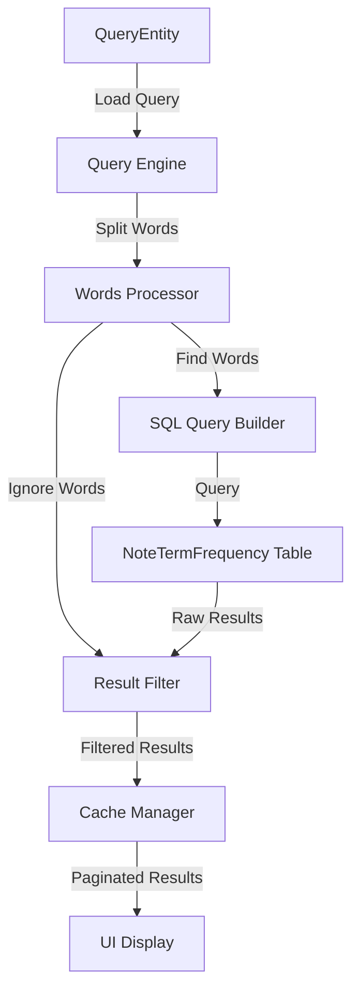
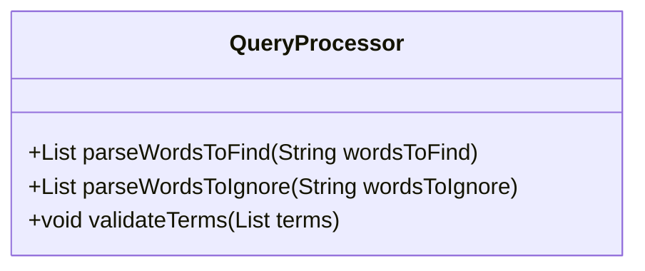
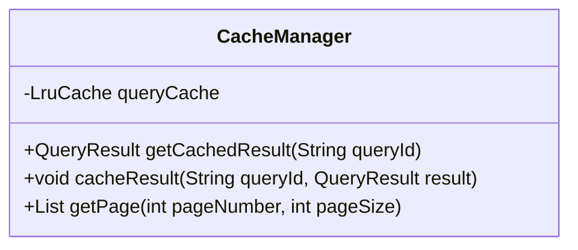

# Query Engine Design

## Overview
The Query Engine is designed to search through note term frequencies using user-defined queries, filter out unwanted terms, and return relevant notes with pagination support and caching.

## Data Flow


## Components

### 1. Query Processor
- Input: `QueryEntity` with `wordsToFind` and `wordsToIgnore`
- Splits comma-separated words into individual terms
- Validates and normalizes search terms



### 2. SQL Query Builder
- Constructs SQL query for `NoteTermFrequency` table
- Optimizes query for performance using indexes
- Example query structure:
```sql
SELECT note_id, term, fq_in_doc 
FROM note_term_frequency 
WHERE term IN (:wordsToFind)
GROUP BY note_id
HAVING COUNT(DISTINCT term) = :totalWordsToFind
```

### 3. Result Filter
- Filters out notes containing ignored terms
- Aggregates term frequencies
- Sorts results by relevance

### 4. Cache Manager


## Data Structures

### QueryResult
```java
class QueryResult {
    String queryId;
    List<Long> noteIds;
    Map<Long, Float> relevanceScores;
    long timestamp;
    int totalResults;
}
```

### Page Configuration
```java
class PageConfig {
    int pageSize = 20;
    int currentPage = 0;
    String sortOrder = "relevance";
}
```

## Caching Strategy
1. **Cache Key**: `queryId = hash(wordsToFind + wordsToIgnore)`
2. **Cache Entry**:
   - Query results
   - Relevance scores
   - Timestamp for cache invalidation
3. **Cache Policy**:
   - LRU (Least Recently Used)
   - Maximum size: 50 queries
   - Time-based invalidation: 1 hour

## Query Execution Flow
1. Check cache for query results
2. If cache miss:
   - Execute SQL query for `wordsToFind`
   - Filter results using `wordsToIgnore`
   - Calculate relevance scores
   - Cache results
3. Return paginated results

## Performance Considerations
1. **Indexing**:
   - Index on `term` column
   - Index on `note_id` column
2. **Batch Processing**:
   - Process large result sets in chunks
3. **Memory Management**:
   - Limit cache size
   - Use cursor-based pagination

## Error Handling
1. **Invalid Queries**:
   - Empty search terms
   - Invalid characters
   - Too many search terms
2. **Database Errors**:
   - Connection failures
   - Timeout handling
3. **Cache Issues**:
   - Cache corruption
   - Invalidation errors

## Future Improvements
1. Fuzzy search support
2. Advanced relevance scoring
3. Real-time query suggestions
4. Query analytics and optimization
