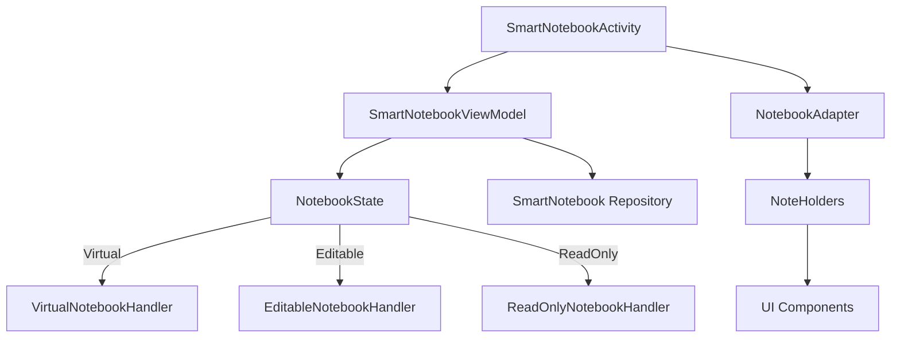
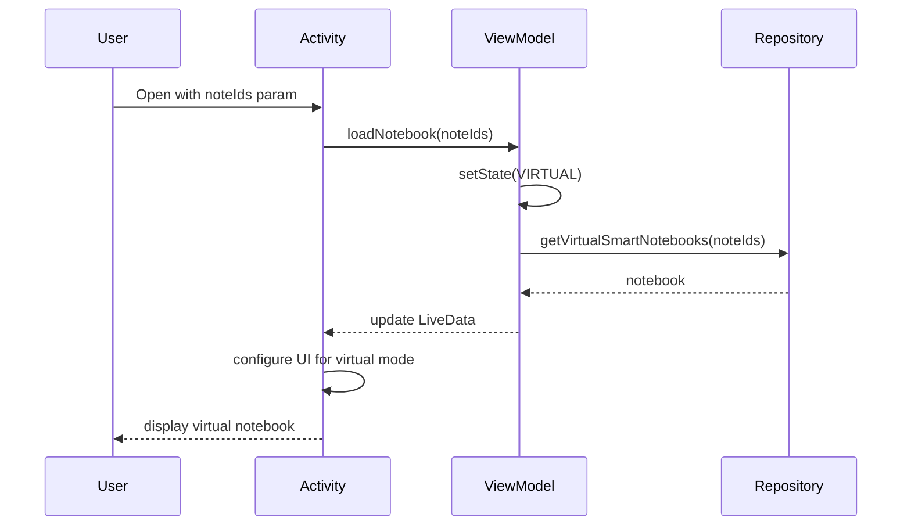
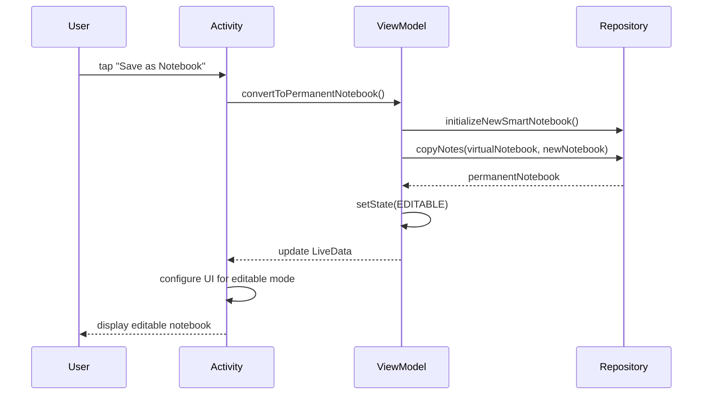

# Smart Notebook Virtual Mode Implementation Solution

## Introduction

This document outlines the solution for implementing Virtual Notebooks functionality in the InkWiseNote application. Virtual Notebooks are temporary, read-only collections of notes that can be viewed and optionally saved as permanent notebooks.

## Requirements

1. Support read-only view of notebooks created from individual notes
2. Prevent autosaving when navigating between pages in virtual mode
3. Disable editing capabilities until explicitly saved as a permanent notebook
4. Hide the "add page" button in virtual mode
5. Provide a save button to convert virtual notebooks to permanent ones
6. Maintain code reusability and extensibility for future notebook modes

## Architecture Overview

The proposed solution follows the MVVM (Model-View-ViewModel) architecture pattern with a State design pattern to handle different notebook modes.



## Component Design

### 1. Notebook States

```java
public enum NotebookState {
    VIRTUAL,    // Temporary collection of notes, read-only with save option
    EDITABLE,   // Normal notebook with full editing capabilities
    READ_ONLY   // Permanent notebook with editing disabled
}
```

### 2. SmartNotebookViewModel

The ViewModel will be the central component managing notebook state and operations:

```java
public class SmartNotebookViewModel extends ViewModel {
    // State management
    private final MutableLiveData<NotebookState> notebookState = new MutableLiveData<>();
    private final MutableLiveData<SmartNotebook> notebook = new MutableLiveData<>();
    
    // UI state
    private final MutableLiveData<Boolean> showAddButton = new MutableLiveData<>();
    private final MutableLiveData<Boolean> showSaveButton = new MutableLiveData<>();
    private final MutableLiveData<Integer> currentPageIndex = new MutableLiveData<>();
    private final MutableLiveData<Integer> totalPages = new MutableLiveData<>();
    
    // Notebook interaction handler
    private NotebookInteractionHandler interactionHandler;
    
    // Methods to load notebook based on intent parameters
    public void loadNotebook(Intent intent) {
        // Determine state based on intent parameters
        // Load notebook content
        // Set appropriate interaction handler
    }
    
    // Navigation methods with state-aware behavior
    public void goToNextPage() {...}
    public void goToPreviousPage() {...}
    
    // Saving methods with state-aware behavior
    public void saveCurrentPage() {...}
    public void saveNotebook() {...}
    
    // Method to convert virtual notebook to permanent
    public void convertToPermanentNotebook() {...}
    
    // LiveData getters
    public LiveData<NotebookState> getNotebookState() {...}
    public LiveData<Boolean> shouldShowAddButton() {...}
    // ...other getters
}
```

### 3. Notebook Interaction Handlers

```java
// Base interface for notebook interactions
public interface NotebookInteractionHandler {
    void saveCurrentPage(AtomicNoteEntity note);
    void navigateToPage(int pageIndex);
    void addNewPage();
    void deleteNote(AtomicNoteEntity note);
    boolean isEditingEnabled();
}

// Implementations for different states
public class VirtualNotebookHandler implements NotebookInteractionHandler {
    @Override
    public void saveCurrentPage(AtomicNoteEntity note) {
        // No-op for virtual notebooks
    }
    
    @Override
    public boolean isEditingEnabled() {
        return false;
    }
    
    // Other implementation methods
}

public class EditableNotebookHandler implements NotebookInteractionHandler {
    @Override
    public void saveCurrentPage(AtomicNoteEntity note) {
        // Save the note to the database
    }
    
    @Override
    public boolean isEditingEnabled() {
        return true;
    }
    
    // Other implementation methods
}
```

### 4. Modified SmartNotebookAdapter

The adapter needs to be aware of the notebook state to control editing capabilities:

```java
public class SmartNotebookAdapter extends RecyclerView.Adapter<NoteHolder> {
    private final NotebookInteractionHandler interactionHandler;
    private SmartNotebook smartNotebook;
    
    public SmartNotebookAdapter(ComponentActivity parentActivity, 
                               SmartNotebook smartNotebook,
                               NotebookInteractionHandler interactionHandler) {
        this.parentActivity = parentActivity;
        this.smartNotebook = smartNotebook;
        this.interactionHandler = interactionHandler;
    }
    
    @Override
    public void onBindViewHolder(@NonNull NoteHolder noteHolder, int position) {
        // Pass the interaction handler to the holder
        noteHolder.setInteractionHandler(interactionHandler);
        // ... rest of binding logic
    }
    
    // Other adapter methods with state-aware behavior
}
```

### 5. Note Holders with State Awareness

Each holder type needs to respect the editing state:

```java
public abstract class NoteHolder extends RecyclerView.ViewHolder {
    protected NotebookInteractionHandler interactionHandler;
    
    public void setInteractionHandler(NotebookInteractionHandler handler) {
        this.interactionHandler = handler;
    }
    
    protected boolean isEditingEnabled() {
        return interactionHandler != null && interactionHandler.isEditingEnabled();
    }
    
    // Abstract methods for note handling
}
```

For example, in the TextNoteHolder:

```java
public class TextNoteHolder extends NoteHolder {
    @Override
    public void setNote(long bookId, AtomicNoteEntity atomicNote) {
        // Load note content
        
        // Enable/disable editing based on state
        noteEditText.setEnabled(isEditingEnabled());
        
        // Show/hide delete button based on state
        deleteBtn.setVisibility(isEditingEnabled() ? View.VISIBLE : View.GONE);
    }
}
```

### 6. SmartNotebookActivity with State-Aware UI

The activity will observe the ViewModel state and update UI accordingly:

```java
public class SmartNotebookActivity extends AppCompatActivity {
    private SmartNotebookViewModel viewModel;
    
    @Override
    protected void onCreate(Bundle savedInstanceState) {
        // Initialize ViewModel
        viewModel = new ViewModelProvider(this).get(SmartNotebookViewModel.class);
        
        // Load notebook based on intent parameters
        viewModel.loadNotebook(getIntent());
        
        // Observe state changes
        viewModel.getNotebookState().observe(this, this::updateUIForState);
        viewModel.shouldShowAddButton().observe(this, show -> 
            addNewNoteButton.setVisibility(show ? View.VISIBLE : View.GONE));
        
        // Setup save button for virtual notebooks
        setupSaveButton();
    }
    
    private void updateUIForState(NotebookState state) {
        // Update UI elements based on state
        // E.g., show save button only in VIRTUAL state
    }
    
    private void setupSaveButton() {
        // Add save button to convert virtual notebook to permanent
        // Only visible in VIRTUAL state
    }
}
```

## User Interface

### 1. Virtual Notebook Mode

```
+---------------------------------------------+
|                                             |
| [Title (Read Only)]         [Page 1/3]      |
|                                             |
| +---------------------------------------+   |
| |                                       |   |
| |                                       |   |
| |        Content (Non-editable)         |   |
| |                                       |   |
| |                                       |   |
| +---------------------------------------+   |
|                                             |
| [< Prev]                        [Next >]    |
|                                             |
|                [SAVE AS NOTEBOOK]           |
|                                             |
+---------------------------------------------+
```

### 2. Permanent Notebook Mode (After Saving)

```
+---------------------------------------------+
|                                             |
| [Title (Editable)]         [Page 1/3]       |
|                                             |
| +---------------------------------------+   |
| |                                       |   |
| |                                       |   |
| |        Content (Editable)             |   |
| |                                       |   |
| |                                       |   |
| +---------------------------------------+   |
|                                             |
| [< Prev]      [+ Add]             [Next >]  |
|                                             |
+---------------------------------------------+
```

## Flow Diagrams

### 1. Opening a Virtual Notebook



### 2. Saving a Virtual Notebook



## Implementation Plan

### Phase 1: Create Core State Classes
1. Define NotebookState enum
2. Create NotebookInteractionHandler interface and implementations

### Phase 2: Build ViewModel
1. Implement SmartNotebookViewModel with state management
2. Add LiveData properties for UI state
3. Implement notebook loading logic with state detection

### Phase 3: Update Adapter and Holders
1. Modify SmartNotebookAdapter to accept interaction handler
2. Update NoteHolder base class to respect editing state
3. Adjust specific holders (Text, Handwritten, Init) for state awareness

### Phase 4: Enhance Activity
1. Update SmartNotebookActivity to use ViewModel
2. Add observers for state changes
3. Implement "Save as Notebook" button
4. Configure UI elements based on state

### Phase 5: Testing and Refinement
1. Test all notebook modes (virtual, editable, read-only)
2. Ensure smooth transitions between states
3. Verify proper data persistence
4. Optimize UI responsiveness

## Benefits of This Approach

1. **Separation of Concerns**: Clean MVVM architecture separates UI, logic, and data
2. **Reusability**: Same components handle different notebook states
3. **Extensibility**: New notebook states can be added with minimal changes
4. **Maintainability**: State-based logic is easier to debug and extend
5. **User Experience**: UI adapts appropriately to notebook state

## Potential Challenges

1. **State Transitions**: Ensuring smooth transitions between states
2. **Legacy Code Integration**: Working with existing components not designed for multiple states
3. **Performance**: Managing potentially large notebook collections efficiently
4. **UI Consistency**: Maintaining consistent interface across different states

## Conclusion

This solution enables the implementation of Virtual Notebooks while maintaining code reusability and extendibility. By employing the MVVM architecture with a State pattern, we create a flexible system that can handle different notebook modes without duplicating code. The approach also lays the groundwork for future notebook types and interaction patterns.
